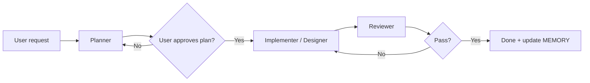

# WORKFLOW.md — Multi-Agent Development Loop

> **Stack note:** This site is **Jekyll + Liquid + vanilla CSS/JS**, not React. The same planner → implement → review loop applies; implementation targets `_sass/`, `_layouts/`, `_includes/`, and `assets/js/`.

## The loop (mandatory for non-trivial work)



| Phase | Agent role | Cursor mode | Output |
|-------|------------|-------------|--------|
| 1. Understand | Planner | **Ask** or **Plan** | `PLAN.md` section or chat plan |
| 2. Approve | Human (you) | — | Explicit "approved" / edits to plan |
| 3. Build | Implementer (+ Designer if UI) | **Agent** | Code diff |
| 4. Verify | Reviewer | **Agent** (read-only mindset) | Review checklist in chat |
| 5. Remember | Any | — | Append `MEMORY.md` if decision is durable |

## Gate rules (non-negotiable)

1. **No plan → no multi-file implementation** for features touching 3+ files or new pages.
2. **No review → task not complete.** Reviewer must run checklist from `.cursor/skills/review-gate/SKILL.md`.
3. **Designer skill required** for any visual change (layout, typography, colors, animations).
4. **Build must pass** before marking done: `bundle exec jekyll build` (and `node scripts/verify-journey-data.js` if `_data/journey.yml` changed).

## When to skip the full loop

- Typo in one markdown file
- Single-line CSS fix with no layout impact
- User explicitly says "quick fix, skip review"

## Invocation (copy into Cursor chat)

**Planner:**
```
Act as Planner (read .cursor/rules/agent-planner.mdc). Produce a plan only — no code.
```

**Implementer:**
```
Plan approved. Act as Implementer (.cursor/rules/agent-implementer.mdc). Follow AGENTS.md and LIMITATIONS.md.
```

**Designer (UI):**
```
Use skill frontend-design (.cursor/skills/frontend-design/SKILL.md). Editorial Monochrome only.
```

**Reviewer (before done):**
```
Act as Reviewer (.cursor/rules/agent-reviewer.mdc + skill review-gate). Do not mark complete until checklist passes.
```

## React / other repos

This workflow is portable. For a React app, swap verification to `npm run build && npm test && npm run lint`. Copy `WORKFLOW.md`, `LIMITATIONS.md`, and `.cursor/rules/` as a template.
