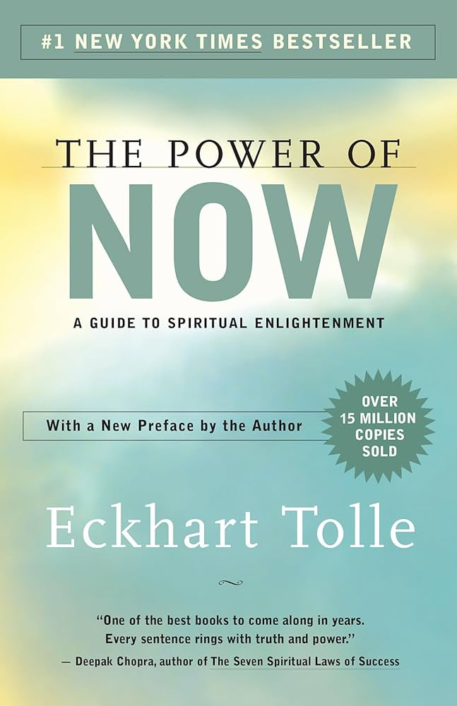
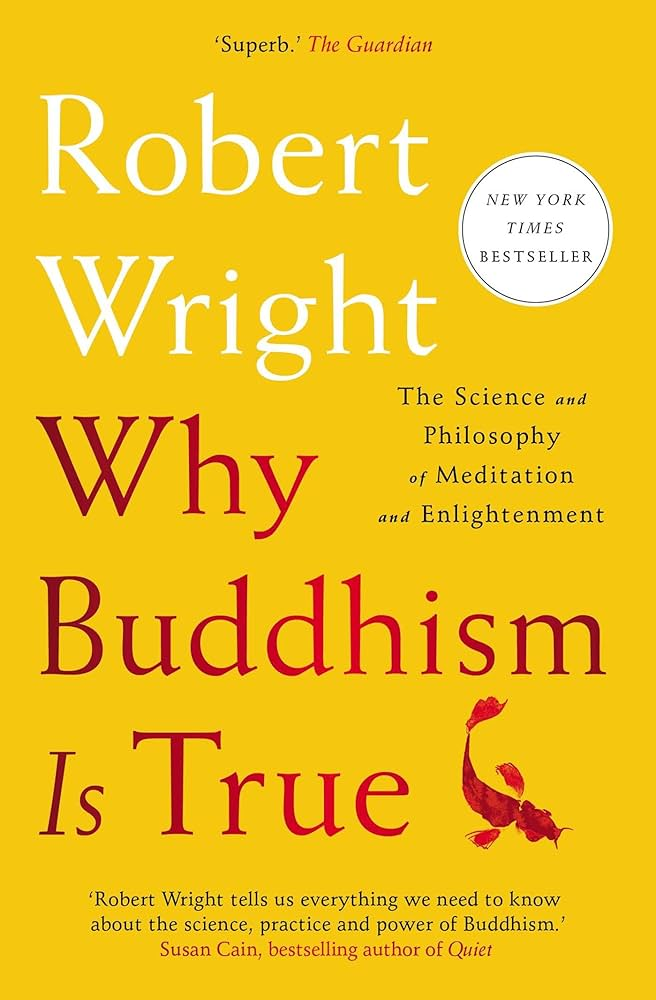
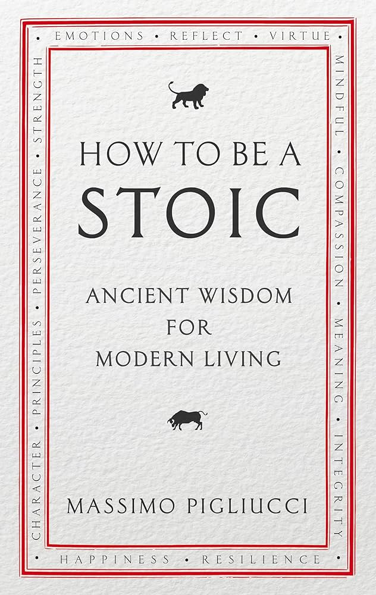
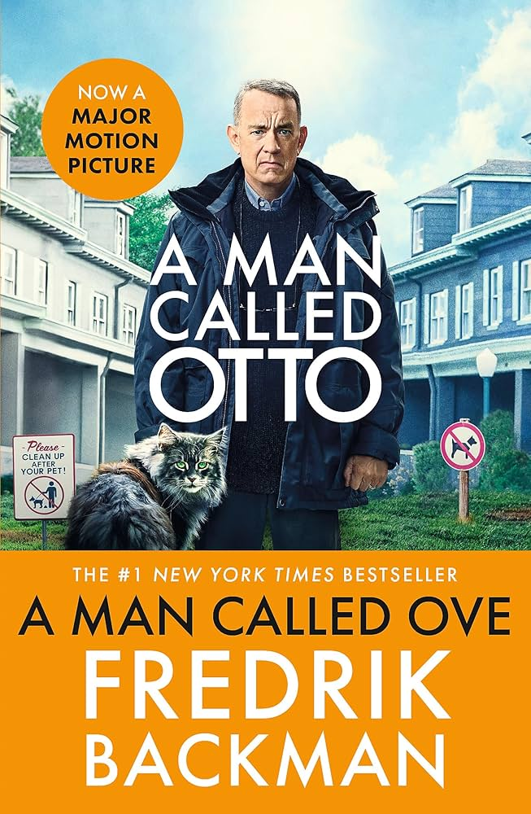
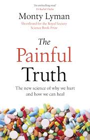
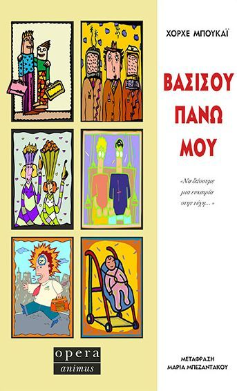

  
This section is dedicated to my personal growth journey. Here you'll find book reviews, course summaries, and media recommendations that have influenced my thinking and development.

## Seminars & Workshops

  

    <h3>Building Robust Experiments with Python and PsychoPy</h3>
    
Universitätsklinikum Bonn

    
Issued: Dec 2024

    
    
This intensive 18-hour workshop provided hands-on experience with experimental design:

    <ul>
      <li>Setting up experiments with 𝘗𝘴𝘺𝘤𝘩𝘰𝘗𝘺, a powerful tool for behavioral research</li>
      <li>Field Validations using 𝘗𝘺𝘥𝘢𝘯𝘵𝘪𝘤 for data integrity</li>
      <li>Implementing 𝘔𝘰𝘤𝘬𝘴 and 𝘗𝘢𝘵𝘤𝘩𝘦𝘴 to simulate dependencies during testing</li>
      <li>Automated Testing with 𝘗𝘺𝘵𝘦𝘴𝘵 to ensure robust and reliable experiments</li>
    </ul>

    
<b>Skills:</b> PsychoPy · Pydantic · pytest · Mocks · Git · GitHub · Patches · Design of Experiments (DOE)

    
    <a href="https://www.linkedin.com/in/dimitrios-georgiou/details/certifications/1737379204518/single-media-viewer/?profileId=ACoAAB9iLVIBxYpeomo-Y21fFLHo-YyxI_Rj_vk" class="btn btn--primary btn--small" target="_blank">View Certificate</a>
  

  

    <h3>ANDA-NI Neuroinformatics Workshop</h3>
    
Universitätsklinikum Bonn

    
Issued: Sep 2024

    
    
Workshop Content:

    <ul>
      <li>Data Representations for Neuroscience Data and Metadata: JSON, YAML, HDF5, NIX and Neo</li>
      <li>Version Control and Data Management with Git, Git-Annex, and DataLad</li>
      <li>Data Sharing Platforms with GitHub and Gin-G-Node</li>
    </ul>

    
<b>Skills:</b> Neo · Gin-G-Node · JSON · Git · Data Representation · Neuroscience · GitHub · NIX · YAML · HDF5 · DataLad · Git-Annex

    
    <a href="https://www.linkedin.com/in/dimitrios-georgiou/details/certifications/1377283814/multiple-media-viewer/?profileId=ACoAAB9iLVIBxYpeomo-Y21fFLHo-YyxI_Rj_vk&treasuryMediaId=1727954364448" class="btn btn--primary btn--small" target="_blank">View Certificate</a>
  

## Online Courses

  

    <h3>Generative AI for Healthcare</h3>
    
Google

    
Issued: Feb 2025

    
Credential ID: 14142481

    
    
<b>Skills:</b> Deep Learning, Generative AI, Prompt Engineering, Large Language Models (LLM), Machine Learning

  

  

    <h3>HelloAI Advanced RIS Scholarship</h3>
    
EIT Health

    
Issued: Jan 2025

    
Credential ID: vpnbd7fxja

    
    
<b>Skills:</b> Bioinformatics · Prompt Engineering · Machine Learning · Healthcare

    
    <a href="https://www.linkedin.com/in/dimitrios-georgiou/details/certifications/1273040901/multiple-media-viewer/?profileId=ACoAAB9iLVIBxYpeomo-Y21fFLHo-YyxI_Rj_vk&treasuryMediaId=1738587313558" class="btn btn--primary btn--small" target="_blank">View Certificate</a>
  

  

## Reading List {#reading-list}

  <h3 id="currently-reading">Currently Reading</h3>
  

    

      
      

        <h4>The Power of Now</h4>
        
by Eckhart Tolle

        
Progress: 60%

        
A guide to spiritual enlightenment that emphasizes living in the present moment and transcending thoughts of the past or future.

      

    

    
    
      
        

          
          

            <h4>{{ book.title }}</h4>
            
by {{ book.author }}

            
Progress: {{ book.progress }}%

            
{{ book.excerpt | truncate: 100 }}

          

        

      
    
  

  <h3 id="recently-completed">Recently Completed</h3>
  

    

      
      

        <h4>Why Buddhism is True</h4>
        
by Robert Wright

        
Rating: ⭐⭐⭐⭐⭐

        
An exploration of Buddhism's core psychological insights through the lens of evolutionary psychology and neuroscience.

      

    

    
    

      
      

        <h4>How to Be Stoic</h4>
        
by Massimo Pigliucci

        
Rating: ⭐⭐⭐⭐

        
A practical guide to applying stoic philosophy to modern life, focusing on virtue, resilience, and inner peace.

      

    

    
    

      
      

        <h4>A Man Called Otto</h4>
        
by Fredrik Backman

        
Rating: ⭐⭐⭐⭐⭐

        
A heartwarming novel about a grumpy yet lovable man who finds his structured life disrupted by new neighbors.

      

    

    
    

      
      

        <h4>The Midnight Library</h4>
        
by Matt Haig

        
Rating: ⭐⭐⭐⭐

        
A novel about a library between life and death where each book represents a different version of what your life could have been.

      

    

    
    

      
      

        <h4>The Painful Truth</h4>
        
by Monty Lyman

        
Rating: ⭐⭐⭐⭐

        
An exploration of pain from scientific, psychological, and philosophical perspectives.

      

    

    
    

      
      

        <h4>Tender is the Night</h4>
        
by F. Scott Fitzgerald

        
Rating: ⭐⭐⭐⭐

        
A psychological novel about the rise and fall of a promising young psychiatrist and his wife.

      

    

    
    

      
      

        <h4>The Subtle Art of Not Giving a F*ck</h4>
        
by Mark Manson

        
Rating: ⭐⭐⭐⭐

        
A counterintuitive approach to living a good life by focusing on what truly matters and letting go of the rest.

      

    

    
    

      
      

        <h4>Βασίσου Πάνω Μου</h4>
        
by Bucay Jorge

        
Rating: ⭐⭐⭐⭐

        
A Greek novel exploring themes of trust, relationships, and personal growth.

      

    

    
    

      
      

        <h4>The Lost Symbol</h4>
        
by Dan Brown

        
Rating: ⭐⭐⭐⭐

        
A thriller following Robert Langdon as he decodes ancient symbols in Washington, D.C. to save his mentor.

      

    

    
    

      
      

        <h4>Sapiens</h4>
        
by Yuval Noah Harari

        
Rating: ⭐⭐⭐⭐⭐

        
A brief history of humankind, exploring how Homo sapiens evolved and came to dominate the planet.

      

    

    
    
      
        

          
          

            <h4><a href="{{ book.url }}">{{ book.title }}</a></h4>
            
by {{ book.author }}

            
Rating: 
              
                ⭐☆
              
            

            
{{ book.excerpt | truncate: 100 }}

            <a href="{{ book.url }}" class="btn btn--primary btn--small">Read Review</a>
          

        

      
    
  

## Media Recommendations {#media-recommendations}

  

    <h3>Podcasts</h3>
    

      
        
          

            
            

              <h4>{{ media.title }}</h4>
              
{{ media.excerpt | truncate: 100 }}

              
                <a href="{{ media.link }}" class="btn btn--primary btn--small" target="_blank">Listen</a>
              
            

          

        
      
    

  

  
  

    <h3>Movies & Series</h3>
    

      
        
          

            
            

              <h4>{{ media.title }}</h4>
              
Rating: 
                
                  ⭐☆
                
              

              
{{ media.excerpt | truncate: 80 }}

            

          

        
      
    

  

## Learning Statistics {#learning-statistics}

  

    <h3>Books Read</h3>
    
25+

    
Since 2020

  

  
  

    <h3>Courses Completed</h3>
    
15+

    
Since 2020

  

  
  

    <h3>Total Learning Hours</h3>
    
500+

    
Invested in self-improvement

  

 