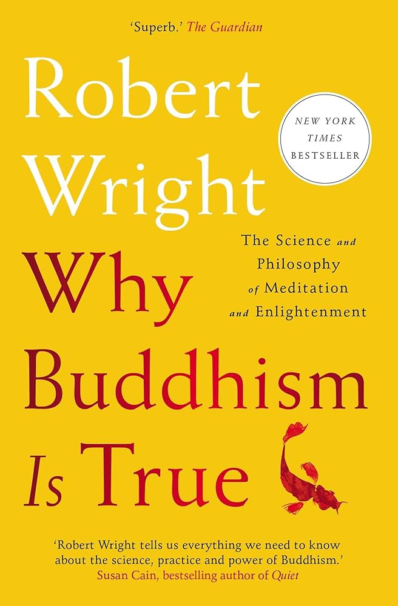
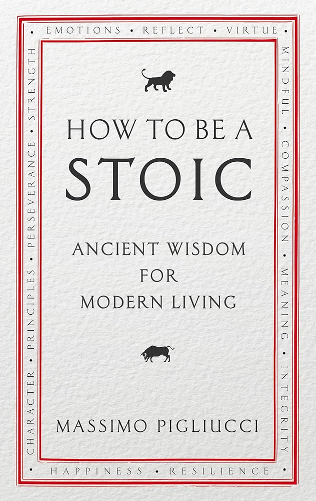
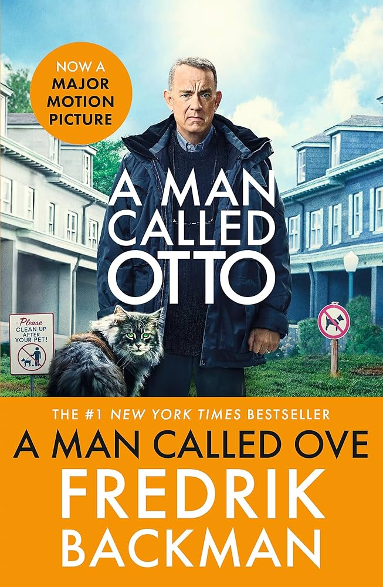
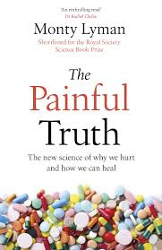
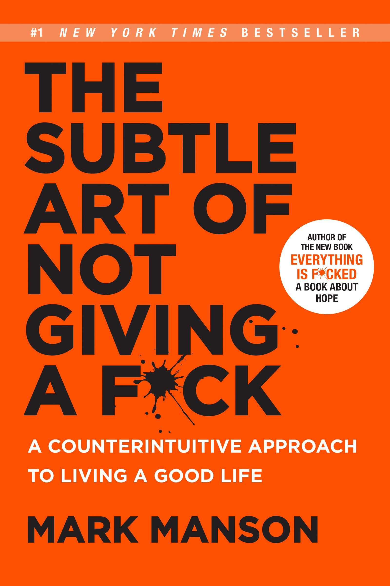
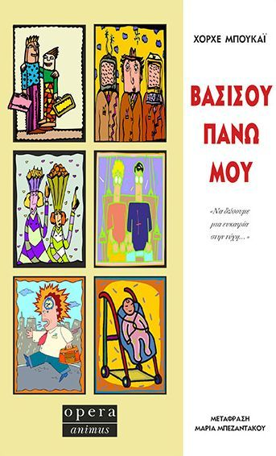
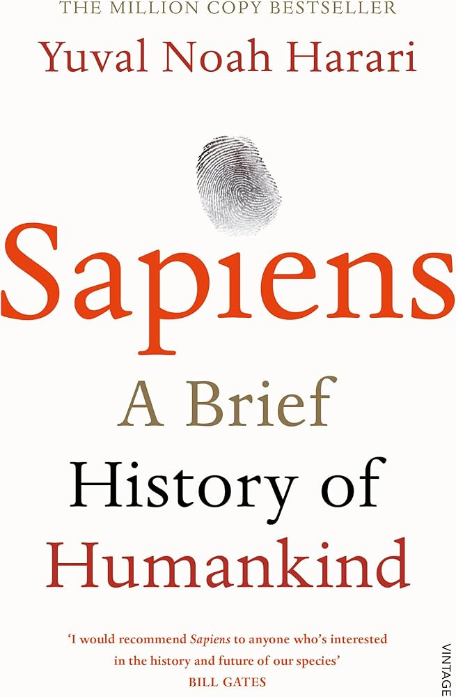

  
This section is dedicated to my personal growth journey. Here you'll find book reviews, course summaries, and media recommendations that have influenced my thinking and development.

## Learning Journey

  

    
📚

    
25+

    
Books Read

    
Since 2020

  

  
  

    
🎓

    
15+

    
Courses Completed

    
Professional Development

  

  
  

    
⏱️

    
500+

    
Learning Hours

    
Continuous Improvement

  

  
  

    
🏆

    
10+

    
Workshops & Seminars

    
Hands-on Training

  

  
  

    
🥇

    
2

    
Competitions

    
Awards Won

  

## Competitions

  

    <h3 id="eit-health-idays-2025-competition">EIT Health i-Days 2025 | 2nd Place 🥈</h3>
    

      

        
        
      

      
EIT Health, Eθνικό Κέντρο Τεκμηρίωσης και Ηλεκτρονικού Περιεχομένου - National Documentation Centre (EKT)

    

    
Issued: Nov 2025

    
<strong>Achievement:</strong> 2nd Place (Nationwide) among 11 teams across undergraduate and postgraduate programs.

    
    
<strong>Event:</strong> i-Days 2025, organized by EKT & EIT Health, in collaboration with National & Kapodistrian University of Athens (NKUA).

    
    
<strong>Project:</strong> HygeIA – AI-powered first-aid app providing step-by-step basic life support guidance and connecting users to 112, leveraging a Greek Large Language Model (LLM).

    
    
<strong>Associated with:</strong> Klimaka NGO

    
    

      

        
        
        
        
        
        <button class="gallery-nav prev" onclick="changeImageIdays(-1)">‹</button>
        <button class="gallery-nav next" onclick="changeImageIdays(1)">›</button>
        
        

          
          
          
          
        

      

    

    
    

      <a href="https://drive.google.com/file/d/1aZjs2kAzZBMuH8KH3b8A4sqkykkCQl7d/view?usp=sharing" class="btn btn--primary btn--small" target="_blank">View Certificate</a>
      <a href="https://www.linkedin.com/posts/dimitrios-georgiou_llms-ai-innovationekt-activity-7395950392242507776-ZHBE?utm_source=share&utm_medium=member_desktop&rcm=ACoAAB9iLVIBxYpeomo-Y21fFLHo-YyxI_Rj_vk" class="btn btn--primary btn--small" target="_blank">LinkedIn Post</a>
    

  

  

    <h3 id="ecog-video-analysis-winner">ECoG Video Analysis | 1st Place 🥇</h3>
    

      

        
        
      

      
Brain ECoG Hackathon

    

    
Issued: Oct 2025

    
<strong>Achievement:</strong> 1st Place in Data Analysis category at the Brain ECoG Hackathon among 69 teams and 404 participants from over 50 countries.

    
    
<strong>Technical Overview:</strong> Advanced neural decoding pipeline for analyzing ECoG data with real-time video synchronization, interactive 3D brain visualizations, and state-of-the-art machine learning models achieving 89.6% accuracy in 7-class visual stimulus classification.

    
    

      

        
        
        
        
        
        <button class="gallery-nav prev" onclick="changeImageEcog(-1)">‹</button>
        <button class="gallery-nav next" onclick="changeImageEcog(1)">›</button>
        
        

          
          
          
          
        

      

    

    
    
<strong>Key Technical Achievements:</strong>

    <ul>
      <li><strong>Data Pipeline:</strong> 160-channel ECoG recordings + 252 synchronized video trials with advanced artifact removal and signal processing</li>
      <li><strong>ML Architecture:</strong> Multiple approaches including CSP-LDA (classic), EEGNet (CNN), and Transformer-based models for robust performance</li>
      <li><strong>Visualization:</strong> Real-time video annotation with multi-region brain activity overlays using plotly and matplotlib</li>
      <li><strong>Deployment:</strong> Interactive web application with live brain-video playback and model inference</li>
      <li><strong>Performance:</strong> 89.6% accuracy on 7-class visual stimulus classification, exceeding baseline by 15%</li>
    </ul>
    
    
<b>Tech Stack:</b> Python, PyTorch, MNE-Python, Scikit-learn, Plotly, Streamlit, NumPy, Pandas, Signal Processing

    
    

      <a href="https://github.com/jimmyg1997/ecog-video-analysis" class="btn btn--primary btn--small" target="_blank">View Code</a>
      <a href="https://www.linkedin.com/feed/update/urn:li:activity:7381093095079178240/" class="btn btn--primary btn--small" target="_blank">LinkedIn Post</a>
    

  

## Seminars & Workshops

  

    <h3 id="ai-advanced-hsbc">AI Advanced</h3>
    

      

        
      

      
HSBC

    

    
Issued: Nov 2025 · Expires: Nov 2027

    
Credential ID: 6f992943-1916-411e-a59c-e3ccc7319e45

    
An AI Advanced badge has been awarded for the completion of the AI Advanced modules within the pathway; covering the topics of the responsible use of AI; 4 core programming languages (Python, SQL, Git and Shell Scripting); Big Data and the statistics necessary for an AI developer; advanced methods for engineering your data ready for your AI application; advanced concepts within Machine Learning; deep learning and how to build and deploy a deep learning model; and a deeper dive into specialisms.

    

      
    

    
<b>Skills:</b> Data Science, Machine Learning, Responsible AI, Python, SQL, Git, Shell Scripting, Big Data, Statistics, Data Engineering, Deep Learning, Model Deployment

    <a href="https://www.credly.com/badges/6f992943-1916-411e-a59c-e3ccc7319e45/public_url" class="btn btn--primary btn--small" target="_blank">Show Credential</a>
  

  

    <h3 id="eebg-2025">East European Bioinformatics & Genomics Workshop (EEBG 2025)</h3>
    

      

        
        
      

      
Jagiellonian University & Małopolska Centre of Biotechnology

    

    
Issued: Jul 2025

    
This one-week intensive workshop held in Kraków, Poland, brought together global researchers and participants to explore cutting-edge advances in genomics, metagenomics, and AI in bioinformatics:

    <ul>
      <li><b>Transcriptomics & Metagenomics:</b> Approaches to study gene expression and microbial communities at scale</li>
      <li><b>Omics for Personalized Medicine:</b> Leveraging genomics for patient-specific diagnostics and therapeutics</li>
      <li><b>Oxford Nanopore Sequencing:</b> Hands-on training with long-read sequencing technologies</li>
      <li><b>Prompt Engineering & LLM Applications:</b> Applying large language models to biological data analysis</li>
      <li><b>Tools & Platforms:</b> Practical sessions with <i>QIIME 2</i>, <i>Galaxy</i>, <i>Geneious</i>, <i>R</i>, and <i>LLM frameworks</i></li>
    </ul>

    
Participants gained deep insights from lectures delivered by internationally recognized scientists, including André G. Uitterlinden (Erasmus Univ), Anton Nekrutenko (PennState), and Tomasz Kościółek (Sano), among many others.

    

      

        
        
        
        
        
        <button class="gallery-nav prev" onclick="changeImageEebg(-1)">‹</button>
        <button class="gallery-nav next" onclick="changeImageEebg(1)">›</button>
        
        

          
          
          
          
        

      

    

    
<b>Skills:</b> Genomics · Metagenomics · Bioinformatics · Transcriptomics · Personalized Medicine · Nanopore Sequencing · QIIME 2 · Galaxy · Geneious · R · Prompt Engineering · Large Language Models · Scientific Programming · AI for Science

    

    <a href="https://www.linkedin.com/posts/dimitrios-georgiou_eebg2025-bioinformatics-genomics-activity-7351247956479479808-OfmN?utm_source=share&utm_medium=member_desktop&rcm=ACoAAB9iLVIBxYpeomo-Y21fFLHo-YyxI_Rj_vk" class="btn btn--primary btn--small" target="_blank">View Certificate</a>
      <a href="https://www.linkedin.com/in/dimitrios-georgiou/recent-activity/all/" class="btn btn--primary btn--small" target="_blank">LinkedIn Post</a>
    

  

  

    <h3 id="aspire-growth-mindset">ASPIRE: Growth Mindset</h3>
    

      

        
      

      
HSBC

    

    
Issued: Jul 2025

    
This professional development certification focused on cultivating a growth mindset and enhancing leadership potential through structured learning, reflection, and real-world application:

    <ul>
      <li><b>Embracing Change:</b> Reinforced adaptability as a core skill in navigating an evolving workplace</li>
      <li><b>Intentional Development:</b> Designed an Individual Development Plan (IDP) with SMART goals in collaboration with a line manager</li>
      <li><b>Personal Effectiveness:</b> Built self-awareness and authenticity through exercises in personal branding and values alignment</li>
      <li><b>Presentation & Communication:</b> Learned to craft impactful messages and engage diverse audiences using structured storytelling techniques</li>
      <li><b>Customer Focus:</b> Solved real-world challenges emphasizing customer-centric thinking and relationship-building</li>
      <li><b>Interview Skills:</b> Practiced the CAR model and behavioral techniques to strengthen career narrative and confidence under pressure</li>
      <li><b>Business Application:</b> Presented strategic learning outcomes to senior leaders, bridging knowledge with tangible impact</li>
    </ul>

    

      
    

    
<b>Skills:</b> Growth Mindset · Professional Development · Communication · Presentation Skills · Customer Focus · Interview Preparation · Personal Branding · Self-awareness · IDP · Career Planning

    

    <a href="https://www.linkedin.com/posts/dimitrios-georgiou_aspire-growth-mindset-was-issued-by-hsbc-activity-7345846619637964800-gPG0?utm_source=share&utm_medium=member_desktop&rcm=ACoAAB9iLVIBxYpeomo-Y21fFLHo-YyxI_Rj_vk" class="btn btn--primary btn--small" target="_blank">View Certificate</a>
      <a href="https://www.linkedin.com/posts/dimitrios-georgiou_aspire-growth-mindset-was-issued-by-hsbc-activity-7345846619637964800-gPG0?utm_source=share&utm_medium=member_desktop&rcm=ACoAAB9iLVIBxYpeomo-Y21fFLHo-YyxI_Rj_vk" class="btn btn--primary btn--small" target="_blank">LinkedIn Post</a>
    

  

  

    <h3 id="spike-analysis-python">Intro to Neural Spike Analysis in Python</h3>
    

      

        
        
      

      
University of Bonn & iBOTS (Innovative Brain Organization Technologies & Signals)

    

    
Issued: Jun 2025

    
This intensive 18-hour workshop focused on extracting, modeling, and analyzing neural spike trains from both real and simulated electrophysiology recordings:

    <ul>
      <li>Spike Train Metrics: Raster plots, PSTHs, and Cross-Correlograms using <i>NumPy</i> and <i>Matplotlib</i> to interpret neural activity</li>
      <li>Spike Detection and Extraction: Filtering, peak detection, and PCA-based clustering using <i>ScipySignal</i>, <i>Scikit-learn</i>, and <i>SpikeInterface</i></li>
      <li>Poisson-Based Statistical Modeling: Investigating neural population structure and coherence with <i>Elephant</i>, <i>Neo</i>, and <i>SciPy</i></li>
      <li>Hands-on implementation in <i>Jupyter Notebooks</i> combining theoretical background with reproducible coding workflows</li>
    </ul>

    

      

        
        
        
        
        
        <button class="gallery-nav prev" onclick="changeImageNeural(-1)">‹</button>
        <button class="gallery-nav next" onclick="changeImageNeural(1)">›</button>
        
        

          
          
          
          
        

      

    

    
<b>Skills:</b> Neural Spike Analysis · Python · NumPy · SciPy · SpikeInterface · Scikit-learn · Elephant · Neo · Jupyter Notebooks · Raster Plots · PSTH · Poisson Modeling · Signal Processing · Experimental Design

    

    <a href="https://www.linkedin.com/posts/dimitrios-georgiou_electrophysiology-rasterplots-psths-activity-7340717565037424641-b7DC/?utm_source=share&utm_medium=member_desktop&rcm=ACoAAB9iLVIBxYpeomo-Y21fFLHo-YyxI_Rj_vk" class="btn btn--primary btn--small" target="_blank">View Certificate</a>
      <a href="https://www.linkedin.com/posts/dimitrios-georgiou_electrophysiology-rasterplots-psths-activity-7340717565037424641-b7DC?utm_source=share&utm_medium=member_desktop&rcm=ACoAAB9iLVIBxYpeomo-Y21fFLHo-YyxI_Rj_vk" class="btn btn--primary btn--small" target="_blank">LinkedIn Post</a>
    

  

  

    <h3 id="lfp-analysis-python">LFP Analysis in Python</h3>
    

      

        
        
      

      
University of Bonn & iBOTS (Innovative Brain Organization Technologies & Signals)

    

    
Issued: Mar 2025

    
This intensive 18-hour workshop provided hands-on experience in analyzing Local Field Potentials (LFPs) and spike data:

    <ul>
      <li>Visualizing continuous neural signals related to behavior using <i>Matplotlib</i></li>
      <li>Frequency analysis of LFPs and spikes with <i>ScipySignal</i> for identifying neural oscillations</li>
      <li>Relating LFPs and spikes via Current Source Density and Coherence Analyses using <i>Elephant</i></li>
      <li>Time-Frequency Decomposition with <i>Wavelet Transform</i> and <i>Fourier Analysis</i></li>
      <li>Neuropixels data processing using <i>Neo</i> and <i>Pandas</i> for large-scale multi-area neural recordings</li>
      <li>Signal filtering and artifact removal via <i>Notch Filtering</i> and <i>Bandpass Filtering</i></li>
    </ul>

    

      

        
        
        
        <button class="gallery-nav prev" onclick="changeImageLfp(-1)">‹</button>
        <button class="gallery-nav next" onclick="changeImageLfp(1)">›</button>
        
        

          
          
        

      

    

    
<b>Skills:</b> Electrophysiology · Python · ScipySignal · Wavelet Transform · Neo · Notch Filtering · Bandpass Filtering · Elephant · Fourier Analysis · Neuropixels · Matplotlib · Pandas · Signal Processing · Experimental Design

    

      <a href="https://www.linkedin.com/posts/dimitrios-georgiou_matplotlib-scipysignal-elephant-activity-7308436851609022464-E5XT?utm_source=share&utm_medium=member_desktop&rcm=ACoAAB9iLVIBxYpeomo-Y21fFLHo-YyxI_Rj_vk" class="btn btn--primary btn--small" target="_blank">View Certificate</a>
      <a href="https://www.linkedin.com/posts/dimitrios-georgiou_matplotlib-scipysignal-elephant-activity-7308436851609022464-E5XT?utm_source=share&utm_medium=member_desktop&rcm=ACoAAB9iLVIBxYpeomo-Y21fFLHo-YyxI_Rj_vk" class="btn btn--primary btn--small" target="_blank">LinkedIn Post</a>
    

  

  

    <h3 id="building-robust-experiments">Building Robust Experiments with Python and PsychoPy</h3>
    

      

        
        
      

      
University of Bonn & iBOTS (Innovative Brain Organization Technologies & Signals)

    

    
Issued: Dec 2024

    
    
This intensive 18-hour workshop provided hands-on experience with experimental design:

    <ul>
      <li>Setting up experiments with 𝘗𝘳𝘰𝘱𝘩𝘰𝘱𝘺, a powerful tool for behavioral research</li>
      <li>Field Validations using 𝘗𝘺𝘥𝘢𝘯𝘵𝘪𝘤 for data integrity</li>
      <li>Implementing 𝘔𝘰𝘤𝘬𝘴 and 𝘗𝘢𝘵𝘤𝘩𝘦𝘴 to simulate dependencies during testing</li>
      <li>Automated Testing with 𝘗𝘺𝘵𝘦𝘴𝘵 to ensure robust and reliable experiments</li>
    </ul>

    

      
    

    
<b>Skills:</b> PsychoPy · Pydantic · pytest · Mocks · Git · GitHub · Patches · Design of Experiments (DOE)

    
    

    <a href="https://www.linkedin.com/in/dimitrios-georgiou/details/certifications/1737379204518/single-media-viewer/?profileId=ACoAAB9iLVIBxYpeomo-Y21fFLHo-YyxI_Rj_vk" class="btn btn--primary btn--small" target="_blank">View Certificate</a>
      <a href="https://www.linkedin.com/posts/dimitrios-georgiou_experimentaldesign-behavioralscience-softwaredevelopment-activity-7275528404844580864-cMVU?utm_source=share&utm_medium=member_desktop&rcm=ACoAAB9iLVIBxYpeomo-Y21fFLHo-YyxI_Rj_vk" class="btn btn--primary btn--small" target="_blank">LinkedIn Post</a>
    

  

  

    <h3 id="anda-ni-neuroinformatics">ANDA-NI Neuroinformatics Workshop</h3>
    

      

        
        
      

      
University of Bonn & iBOTS (Innovative Brain Organization Technologies & Signals)

    

    
Issued: Sep 2024

    
    
Workshop Content:

    <ul>
      <li>Data Representations for Neuroscience Data and Metadata: JSON, YAML, HDF5, NIX and Neo</li>
      <li>Version Control and Data Management with Git, Git-Annex, and DataLad</li>
      <li>Data Sharing Platforms with GitHub and Gin-G-Node</li>
    </ul>

    

      
    

    
<b>Skills:</b> Neo · Gin-G-Node · JSON · Git · Data Representation · Neuroscience · GitHub · NIX · YAML · HDF5 · DataLad · Git-Annex

    
    

    <a href="https://www.linkedin.com/in/dimitrios-georgiou/details/certifications/1377283814/multiple-media-viewer/?profileId=ACoAAB9iLVIBxYpeomo-Y21fFLHo-YyxI_Rj_vk&treasuryMediaId=1727954364448" class="btn btn--primary btn--small" target="_blank">View Certificate</a>
      <a href="https://www.linkedin.com/posts/dimitrios-georgiou_neuroinformatics-datascience-neuroscience-activity-7247568312199487489-RN98?utm_source=share&utm_medium=member_desktop&rcm=ACoAAB9iLVIBxYpeomo-Y21fFLHo-YyxI_Rj_vk" class="btn btn--primary btn--small" target="_blank">LinkedIn Post</a>
    

  

## Online Courses

  

    <h3 id="early-hta-introductory-course">Early Health Technology Assessment (eHTA) Introductory Course</h3>
    

      

        
      

      
EIT Health InnoStars & EIT Health

    

    
Issued: Jul 2025

    
A short but impactful course covering strategic pricing, net present value (NPV), and engaging healthcare providers and patients as decision-makers. The course provides practical frameworks for creating valuable and sustainable health services, especially relevant for early-phase healthcare and digital health solutions.

    

      

        
        
        
        <button class="gallery-nav prev" onclick="changeImageEhta(-1)">‹</button>
        <button class="gallery-nav next" onclick="changeImageEhta(1)">›</button>
        
        

          
          
        

      

    

    
<b>Skills:</b> Health Technology Assessment, Strategic Pricing, Net Present Value (NPV), Value-Based Care, Digital Health, Healthcare Innovation, Nonprofit Healthcare, Stakeholder Engagement

    

    <a href="https://www.linkedin.com/posts/dimitrios-georgiou_earlyhta-digihealthpt-innostars-activity-7339192358145511425-OLgu?utm_source=share&utm_medium=member_desktop&rcm=ACoAAB9iLVIBxYpeomo-Y21fFLHo-YyxI_Rj_vk" class="btn btn--primary btn--small" target="_blank">View Certificate</a>
      <a href="https://www.linkedin.com/posts/dimitrios-georgiou_earlyhta-digihealthpt-innostars-activity-7339192358145511425-OLgu?utm_source=share&utm_medium=member_desktop&rcm=ACoAAB9iLVIBxYpeomo-Y21fFLHo-YyxI_Rj_vk" class="btn btn--primary btn--small" target="_blank">LinkedIn Post</a>
    

  

  

    <h3 id="generative-ai-healthcare">Generative AI for Healthcare</h3>
    

      

        
      

      
Google

    

    
Issued: Feb 2025

    
Credential ID: 14142481

    
    
This comprehensive course explores how generative AI technologies can transform healthcare delivery, covering applications in medical imaging, clinical documentation, drug discovery, and personalized treatment recommendations using large language models and advanced AI techniques.

    
    

      
    

    
    
<b>Skills:</b> Deep Learning, Generative AI, Prompt Engineering, Large Language Models (LLM), Machine Learning

  

  

  

    <h3 id="helloai-advanced-ris">HelloAI Advanced RIS Scholarship</h3>
    

      

        
      

      
EIT Health

    

    
Issued: Jan 2025

    
Credential ID: vpnbd7fxja

    
    
HelloAI is an educational program that bridges the gap between <strong>artificial intelligence and healthcare</strong>, equipping professionals with the knowledge and skills to apply AI in medical imaging, diagnostics, drug discovery, and personalized medicine. Through expert-led lectures, real-world case studies, live discussions with industry leaders, and hands-on projects, participants gain practical insights into AI's transformative role in healthcare.

    
    
Beyond the technical insights, HelloAI also provided a fantastic networking opportunity, connecting me with professionals across HealthTech, DataScience, and AIResearch. I'm excited to apply these learnings to future projects and contribute to the future of healthcare! A great example of its impact is this thought-provoking discussion with healthcare AI leaders: <a href="https://lnkd.in/dN-gQcse" target="_blank" rel="noopener noreferrer">https://lnkd.in/dN-gQcse</a>

    
    

      
  

    
<b>Skills:</b> Bioinformatics · Prompt Engineering · Machine Learning · Healthcare

    
    

      <a href="https://www.linkedin.com/in/dimitrios-georgiou/details/certifications/1273040901/multiple-media-viewer/?profileId=ACoAAB9iLVIBxYpeomo-Y21fFLHo-YyxI_Rj_vk&treasuryMediaId=1738587313558" class="btn btn--primary btn--small" target="_blank">View Certificate</a>
      <a href="https://www.linkedin.com/posts/dimitrios-georgiou_eithealth-networking-healthtech-activity-7292162583011196928-wQ3c?utm_source=share&utm_medium=member_desktop&rcm=ACoAAB9iLVIBxYpeomo-Y21fFLHo-YyxI_Rj_vk" class="btn btn--primary btn--small" target="_blank">LinkedIn Post</a>
      <a href="https://www.linkedin.com/posts/dimitrios-georgiou_helloai-healthcareai-healthcareai-activity-7267834847765680131-Ovr3?utm_source=share&utm_medium=member_desktop&rcm=ACoAAB9iLVIBxYpeomo-Y21fFLHo-YyxI_Rj_vk" class="btn btn--primary btn--small" target="_blank">LinkedIn Post 2</a>
    

  

## Reading List

  <h3 id="currently-reading">Currently Reading</h3>
  

    
    
      
        

          
Currently Reading

          
          

            <h4 id="{{ book.title | slugify }}">{{ book.title }}</h4>
            
by {{ book.author }}

            
Progress: {{ book.progress }}%

            
{{ book.excerpt | truncate: 100 }}

          

        

      
    
  

  <h3 id="recently-completed">Recently Completed</h3>
  

    

      
      

        <h4 id="1984">1984</h4>
        
by George Orwell

        
Rating: ⭐⭐⭐⭐

        
A dystopian novel about totalitarian surveillance and thought control in a future society. A timeless masterpiece that remains eerily relevant today.

        

          

            
<strong>My Review:</strong> I love how διαχρονικό (timeless) this book is. It's literally talking about telescreens that watch us all the time and we cannot escape from our fate - basically what big companies are doing today...

            <button class="btn btn--primary btn--small" onclick="toggleBookReview('1984')">Read Full Review</button>
          

          

            
<strong>My Review:</strong>

            
I love how διαχρονικό (timeless) this book is. It's literally talking about telescreens that watch us all the time and we cannot escape from our fate - basically what big companies are doing today. The parallels between Orwell's vision and our current reality with constant surveillance, data collection, and the loss of privacy are striking.

            
I'm a bit sad that the book had only 3 parts and not so much action, but it's a book of knowledge - I learned a lot about communism and actually about fascism specifically. The way Orwell explores the mechanisms of totalitarian control, thought manipulation, and the destruction of individual freedom is both educational and deeply disturbing.

            
It also touches on parts of "The Art of War" (war is peace), which gives me motivation to read that essential book next. The concept of doublethink and the manipulation of language to control thought is particularly fascinating.

            
Overall, I recommend it. I'm so sad about Winston (spoiler alert), but we cannot escape! There was hope of rebellion and it happened many times throughout history, but not this time. The ending is heartbreaking and serves as a powerful warning about the fragility of human resistance against absolute power.

            <button class="btn btn--primary btn--small" onclick="toggleBookReview('1984')">Collapse Review</button>
          

        

        <a href="https://www.goodreads.com/book/show/61439040-1984" class="btn btn--primary btn--small" target="_blank" style="margin-top: 0.5rem;">View on Goodreads</a>
      

    

    
    

      
      

        <h4 id="power-of-now">The Power of Now</h4>
        
by Eckhart Tolle

        
Rating: ⭐⭐⭐⭐⭐

        
A guide to spiritual enlightenment that emphasizes living in the present moment and transcending thoughts of the past or future.

      

    

    
    

      
      

        <h4 id="why-buddhism-is-true">Why Buddhism is True</h4>
        
by Robert Wright

        
Rating: ⭐⭐⭐⭐⭐

        
An exploration of Buddhism's core psychological insights through the lens of evolutionary psychology and neuroscience.

      

    

    
    

      
      

        <h4 id="how-to-be-stoic">How to Be Stoic</h4>
        
by Massimo Pigliucci

        
Rating: ⭐⭐⭐⭐

        
A practical guide to applying stoic philosophy to modern life, focusing on virtue, resilience, and inner peace.

      

    

    
    

      
      

        <h4 id="a-man-called-otto">A Man Called Otto</h4>
        
by Fredrik Backman

        
Rating: ⭐⭐⭐⭐⭐

        
A heartwarming novel about a grumpy yet lovable man who finds his structured life disrupted by new neighbors.

      

    

    
    

      
      

        <h4 id="midnight-library">The Midnight Library</h4>
        
by Matt Haig

        
Rating: ⭐⭐⭐⭐

        
A novel about a library between life and death where each book represents a different version of what your life could have been.

      

    

    
    

      
      

        <h4 id="painful-truth">The Painful Truth</h4>
        
by Monty Lyman

        
Rating: ⭐⭐⭐⭐

        
An exploration of pain from scientific, psychological, and philosophical perspectives.

      

    

    
    

      
      

        <h4 id="tender-is-the-night">Tender is the Night</h4>
        
by F. Scott Fitzgerald

        
Rating: ⭐⭐⭐⭐

        
A psychological novel about the rise and fall of a promising young psychiatrist and his wife.

      

    

    
    

      
      

        <h4 id="subtle-art-not-giving-fck">The Subtle Art of Not Giving a F*ck</h4>
        
by Mark Manson

        
Rating: ⭐⭐⭐⭐

        
A counterintuitive approach to living a good life by focusing on what truly matters and letting go of the rest.

      

    

    
    

      
      

        <h4 id="vasishou-panw-mou">Βασίσου Πάνω Μου</h4>
        
by Bucay Jorge

        
Rating: ⭐⭐⭐⭐

        
A Greek novel exploring themes of trust, relationships, and personal growth.

      

    

    
    

      
      

        <h4 id="lost-symbol">The Lost Symbol</h4>
        
by Dan Brown

        
Rating: ⭐⭐⭐⭐

        
A thriller following Robert Langdon as he decodes ancient symbols in Washington, D.C. to save his mentor.

      

    

    
    

      
      

        <h4 id="sapiens">Sapiens</h4>
        
by Yuval Noah Harari

        
Rating: ⭐⭐⭐⭐⭐

        
A brief history of humankind, exploring how Homo sapiens evolved and came to dominate the planet.

      

    

    
    
      
        

          
          

            <h4 id="{{ book.title | slugify }}"><a href="{{ book.url }}">{{ book.title }}</a></h4>
            
by {{ book.author }}

            
Rating: 
              
                ⭐☆
              
            

            
{{ book.excerpt | truncate: 100 }}

            <a href="{{ book.url }}" class="btn btn--primary btn--small">Read Review</a>
          

        

      
    
  

## Podcasts

  

    

      
        
          

            
            

              <h4 id="{{ media.title | slugify }}">{{ media.title }}</h4>
              
{{ media.excerpt | truncate: 100 }}

              
                <a href="{{ media.link }}" class="btn btn--primary btn--small" target="_blank">Listen</a>
              
            

          

        
      
    

    

  

  
## Movies & Series

  

    

      
        
          

            
            

              <h4 id="{{ media.title | slugify }}">{{ media.title }}</h4>
              
Rating: 
                
                  ⭐☆
                
              

              
{{ media.excerpt | truncate: 80 }}

            

          

        
      
    

  

  

  
<!-- Image Lightbox Modal -->

  &times;
  &#10094;
  &#10095;
  

    
  

  

