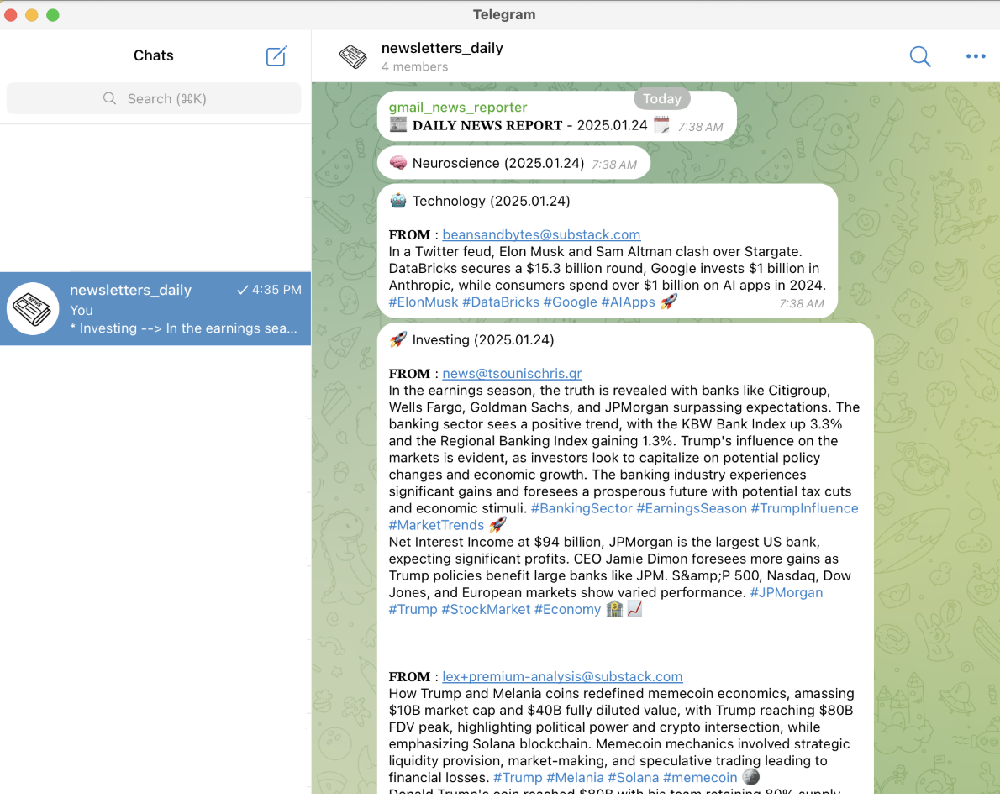
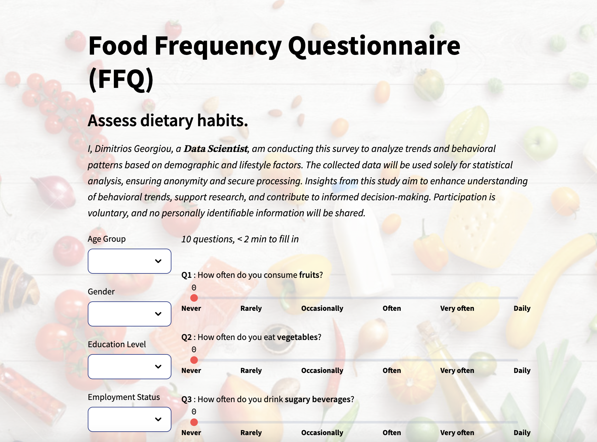
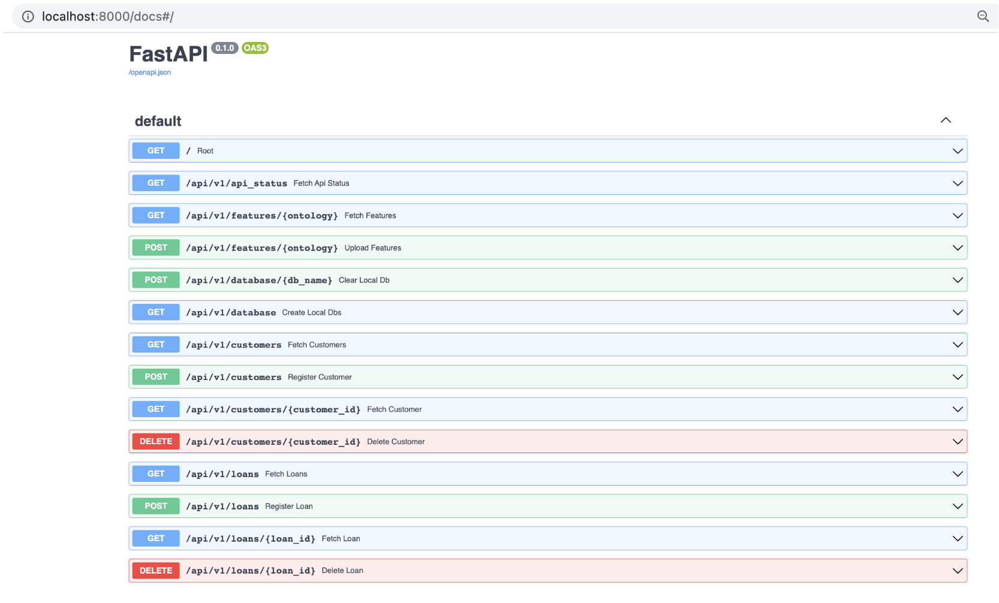
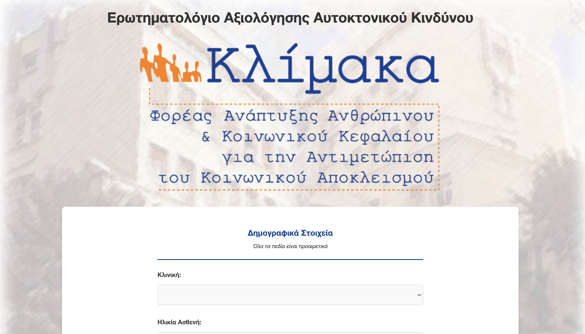
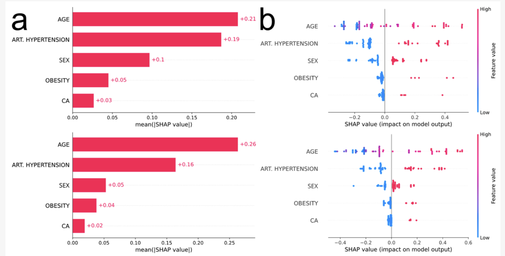

  
My work spans across various domains of data science, machine learning, and healthcare informatics. This page provides an overview of my major project categories.

## Non-coding Projects {#non-coding-projects}

  <h3>Bonobo Gentlemen Podcast</h3>
  

    

      
      

        
A podcast series exploring personal development, technology, and life experiences. Each episode features in-depth discussions on various topics, from overthinking to personal growth.

        

          <a href="https://open.spotify.com/episode/6A4DSZ3T7MX6pTnh0XDlau" class="btn btn--primary" target="_blank">Listen on Spotify</a>
        

      

    

  

## Data Science Projects {#data-science-projects}

  <h3>Gmail Newsletter Reporter</h3>
  

    

      
      

        
📧 A Python-based automation project that integrates Gmail, Google Sheets, Google Docs, Telegram and OpenAI APIs to streamline email summarization and report generation. It leverages CLI configurations to provide a seamless experience.

        

          <a href="https://github.com/jimmyg1997/gmail-newsletter-reporter" class="btn btn--primary" target="_blank">View on GitHub</a>
        

      

    

  

  <h3>Polls Analyzer</h3>
  

    

      
      

        
📊💬 Streamlit App to Create & Analyze Polls. Design polls, collect responses, and visualize results in real-time 🚀. Get insights quickly with interactive charts and analytics 📈.

        

          <a href="https://github.com/jimmyg1997/polls-analyzer" class="btn btn--primary" target="_blank">View on GitHub</a>
        

      

    

  

  <h3>ML Feature Engineering FastAPI Docker</h3>
  

    

      
      

        
🤖 Docker Compose image with Uvicorn managed for a simple Machine Learning Feature Engineering FastAPI web application in Python 3.6 and above with multiple endpoints.

        

          <a href="https://github.com/jimmyg1997/ml-feature-engineering-fastapi-docker" class="btn btn--primary" target="_blank">View on GitHub</a>
        

      

    

  

## Healthcare & PhD Projects {#healthcare-projects}

  <h3>Suicide Prevention Survey</h3>
  

    

      
      

        
A Streamlit-based web app designed for Greek hospitals, allowing doctors to complete a survey for their patients to assess suicide risk.

        

          <a href="https://github.com/jimmyg1997/suicide-prevention-survey" class="btn btn--primary" target="_blank">View on GitHub</a>
        

      

    

  

  <h3>COVID-19 Tabular Classification Genes</h3>
  

    

      
      

        
This tool is built by using machine learning techniques in order to help doctors in the diagnosis of COVID-19 status based only on genetic factors.

        

          <a href="https://github.com/jimmyg1997/COVID-19-Tabular-Classification-Genes" class="btn btn--primary" target="_blank">View on GitHub</a>
        

      

    

  

## Project Skills & Technologies {#project-skills-technologies}

### Languages & Tools {#languages-tools}
* Python
* C/C++
* SQL
* MATLAB
* Java
* HTML/CSS/JS

### ML & Data Science {#ml-data-science}
* TensorFlow
* PyTorch
* Scikit-learn
* Keras
* 🤗 Hugging Face

### Data Processing {#data-processing}
* Pandas
* NumPy
* SciPy
* OpenCV

### Visualization {#visualization}
* Matplotlib
* Seaborn
* Plotly
* Tableau
* Grafana 