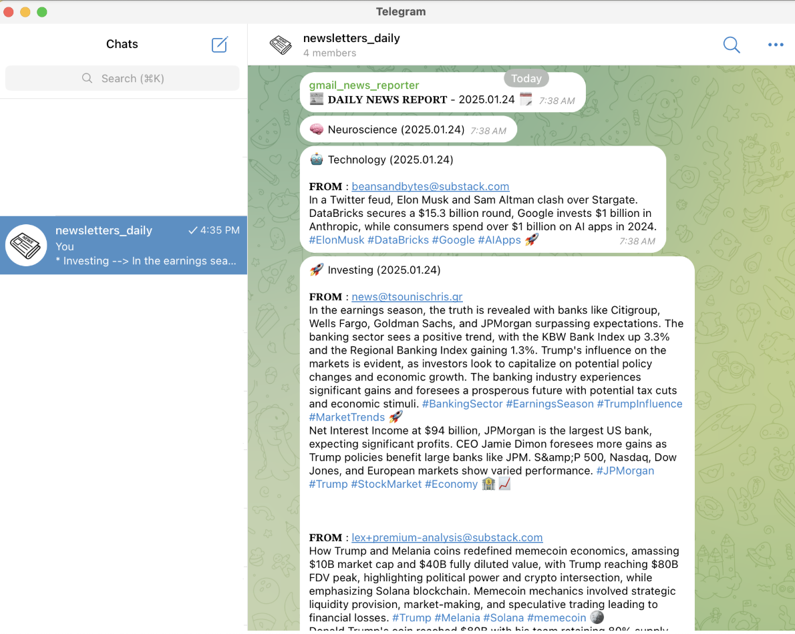
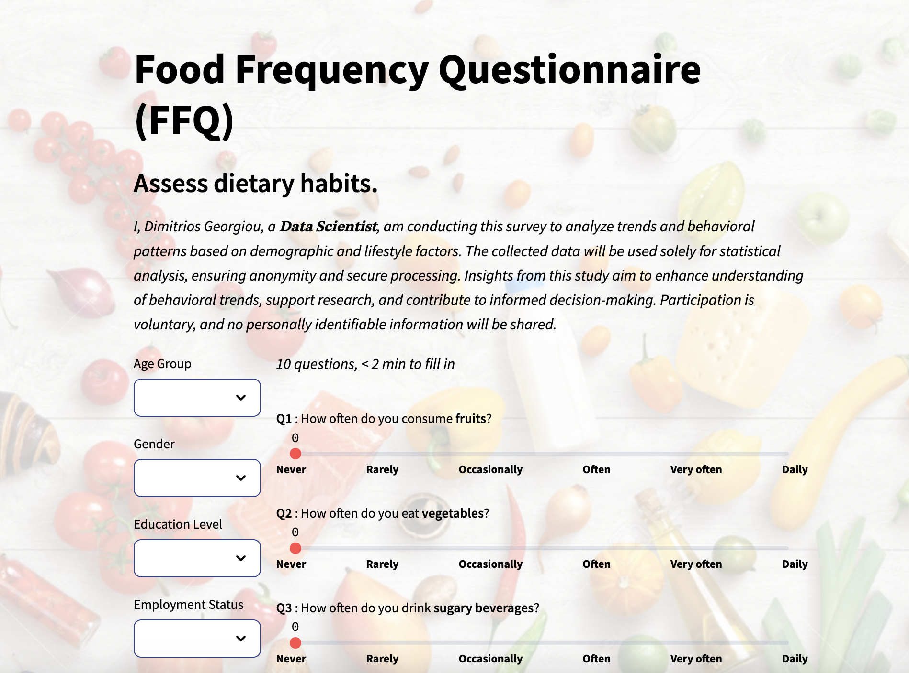
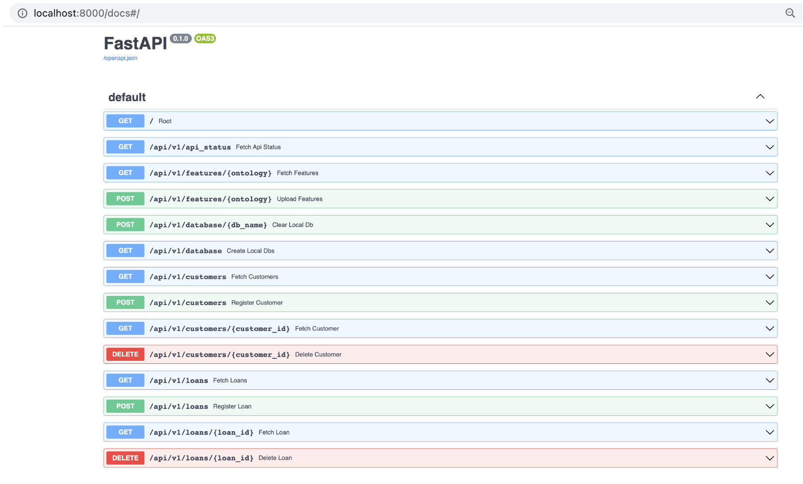
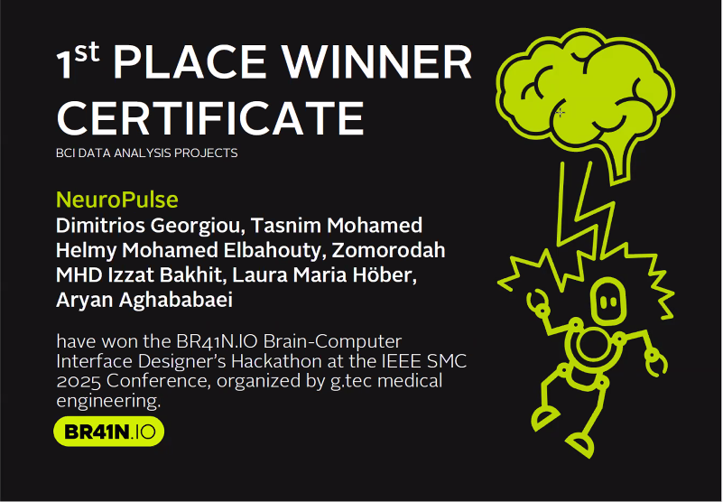
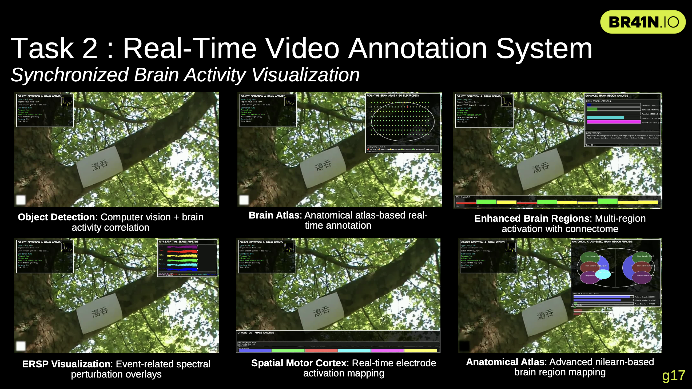
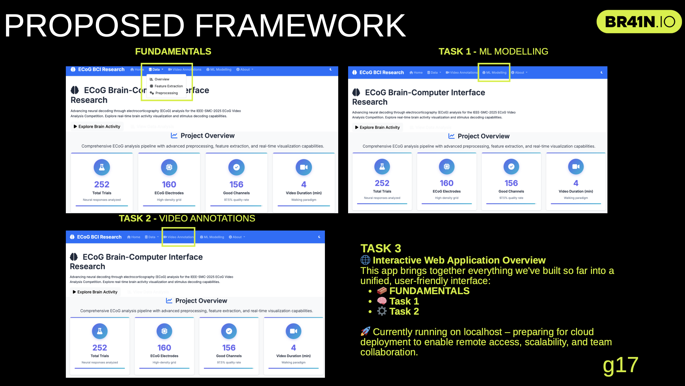
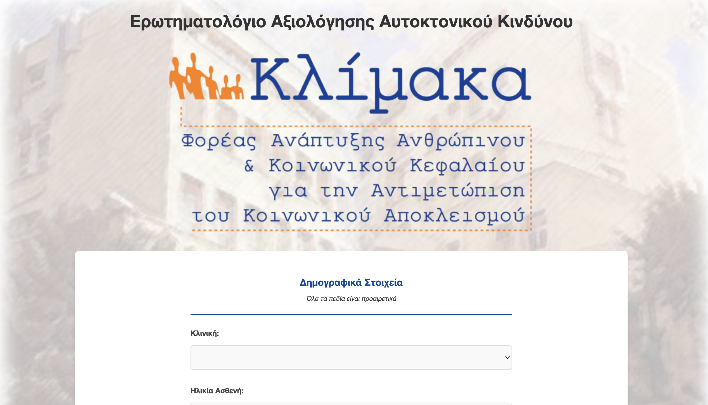
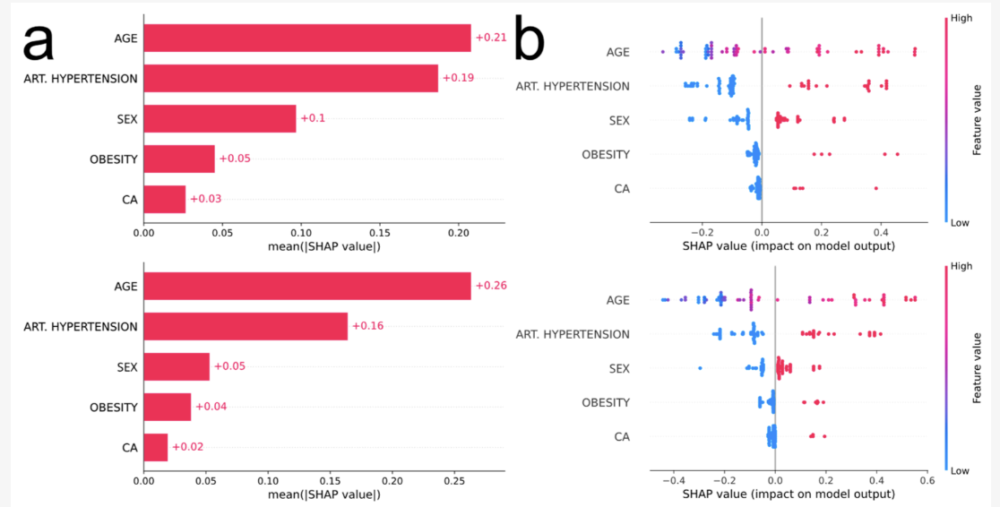
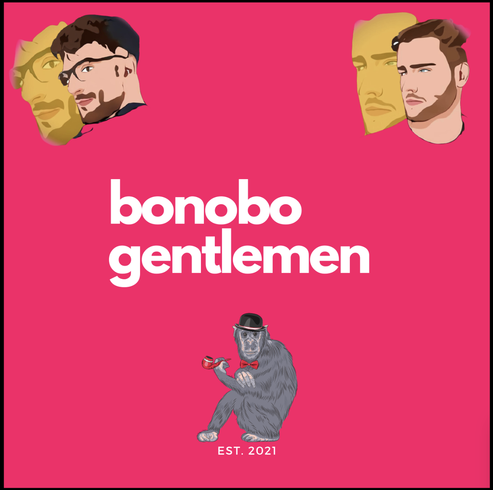

  
My work spans across various domains of data science, machine learning, and healthcare informatics. This page provides an overview of my major project categories.

## Data Science Projects {#data-science-projects}

  <h3 id="gmail-newsletter-reporter">Gmail Newsletter Reporter</h3>
  

    

      
      

        
📧 A Python-based automation project that integrates Gmail, Google Sheets, Google Docs, Telegram and OpenAI APIs to streamline email summarization and report generation. It leverages CLI configurations to provide a seamless experience.

        

          <a href="https://github.com/jimmyg1997/gmail-newsletter-reporter" class="btn btn--primary" target="_blank">View on GitHub</a>
        

      

    

  

  <h3 id="polls-analyzer">Polls Analyzer</h3>
  

    

      
      

        
📊💬 Streamlit App to Create & Analyze Polls. Design polls, collect responses, and visualize results in real-time 🚀. Get insights quickly with interactive charts and analytics 📈.

        

          <a href="https://github.com/jimmyg1997/polls-analyzer" class="btn btn--primary" target="_blank">View on GitHub</a>
        

      

    

  

  <h3 id="ml-feature-engineering-fastapi">ML Feature Engineering FastAPI Docker</h3>
  

    

      
      

        
🤖 Docker Compose image with Uvicorn managed for a simple Machine Learning Feature Engineering FastAPI web application in Python 3.6 and above with multiple endpoints.

        

          <a href="https://github.com/jimmyg1997/ml-feature-engineering-fastapi-docker" class="btn btn--primary" target="_blank">View on GitHub</a>
        

      

    

  

## Healthcare & PhD Projects {#healthcare-projects}

  <h3 id="ecog-video-analysis">🏆 ECoG Video Analysis - 1st Place Winner</h3>
  

    

      

        

          
          
          
          
          
          
          <button class="gallery-nav prev" onclick="changeImage(-1)">‹</button>
          <button class="gallery-nav next" onclick="changeImage(1)">›</button>
          
          

            
            
            
            
            
          

        

      

      

        
🧠 <strong>1st Place Winner</strong> in the Data Analysis category at the Brain ECoG Hackathon among 69 teams and 404 participants from over 50 countries! 🌍

        
Advanced neural decoding pipeline for analyzing ECoG data with real-time video synchronization, interactive 3D brain visualizations, and state-of-the-art machine learning models achieving 89.6% accuracy in 7-class visual stimulus classification.

        
<strong>Key Achievements:</strong>

        <ul>
          <li>160-channel ECoG + 252 video trials with advanced artifact removal</li>
          <li>Multiple ML approaches: CSP-LDA, EEGNet, transformers</li>
          <li>Real-time video annotation with multi-region brain overlays</li>
          <li>Interactive web application with live brain-video playback</li>
        </ul>
        

          <a href="https://github.com/jimmyg1997/ecog-video-analysis" class="btn btn--primary" target="_blank">View on GitHub</a>
          <a href="https://www.linkedin.com/feed/update/urn:li:activity:7381093095079178240/" class="btn btn--primary" target="_blank">LinkedIn Post</a>
        

      

    

  

  <h3 id="suicide-prevention-survey">Suicide Prevention Survey</h3>
  

    

      
      

        
A Streamlit-based web app designed for Greek hospitals, allowing doctors to complete a survey for their patients to assess suicide risk.

        

          <a href="https://github.com/jimmyg1997/suicide-prevention-survey" class="btn btn--primary" target="_blank">View on GitHub</a>
        

      

    

  

  <h3 id="covid-19-classification">COVID-19 Tabular Classification Genes</h3>
  

    

      
      

        
This tool is built by using machine learning techniques in order to help doctors in the diagnosis of COVID-19 status based only on genetic factors.

        

          <a href="https://github.com/jimmyg1997/COVID-19-Tabular-Classification-Genes" class="btn btn--primary" target="_blank">View on GitHub</a>
        

      

    

  

## Non-coding Projects {#non-coding-projects}

  <h3 id="bonobo-gentlemen-podcast">Bonobo Gentlemen Podcast</h3>
  

    

      
      

        
A podcast series exploring personal development, technology, and life experiences. Each episode features in-depth discussions on various topics, from overthinking to personal growth.

        

          <a href="https://open.spotify.com/episode/6A4DSZ3T7MX6pTnh0XDlau" class="btn btn--primary" target="_blank">Listen on Spotify</a>
        

      

    

  

