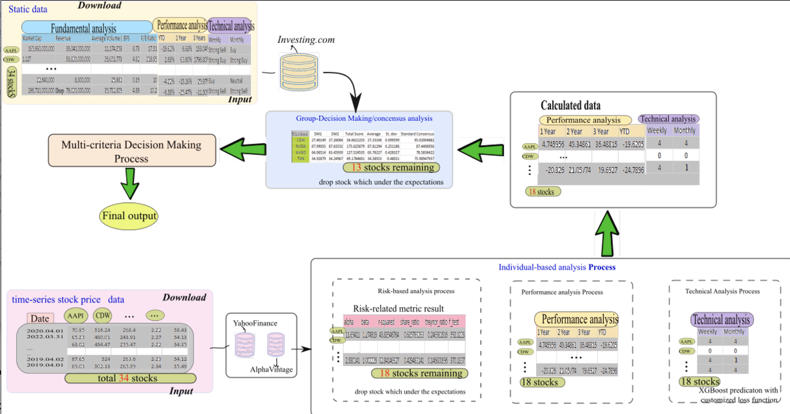
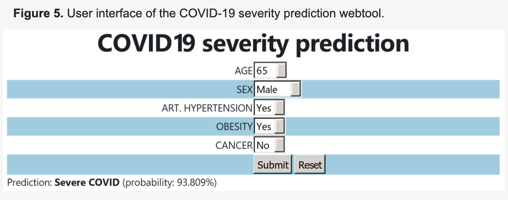
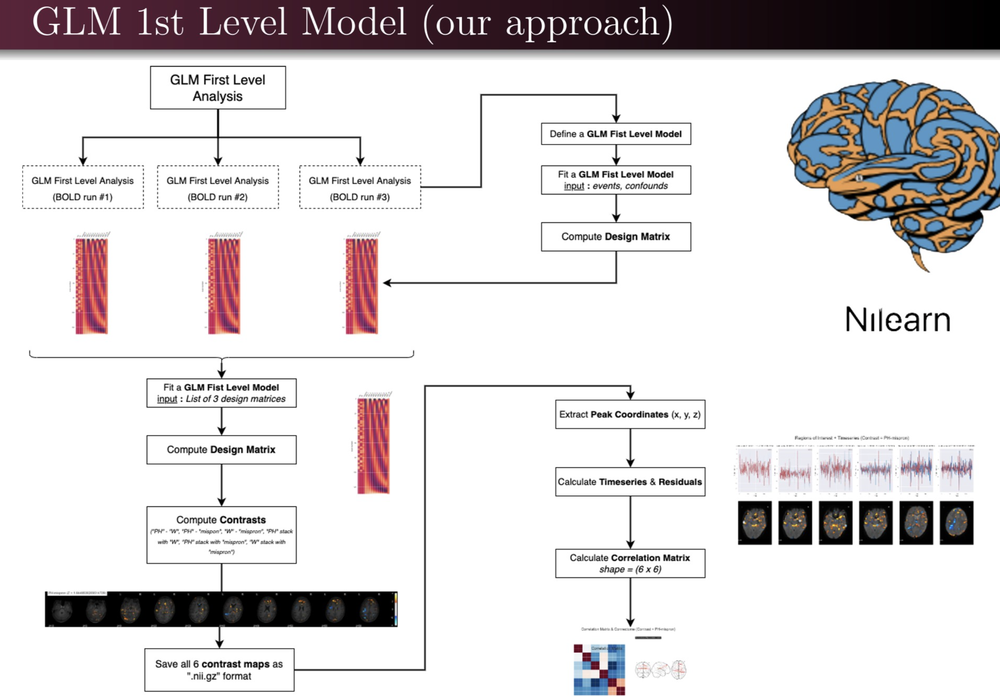
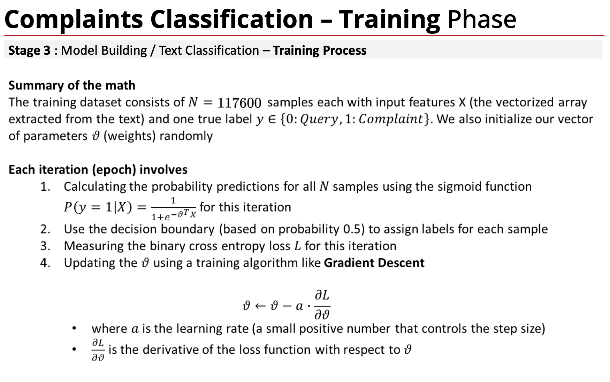

## Academic Publications

  <h3 id="multi-source-fusion-stock-selection">A Generalization of Multi-Source Fusion-Based Framework to Stock Selection</h3>
  
V Snášel, JD Velásquez, M Pant, D Georgiou, L Kong

  
<em>Information Fusion</em>, 2024

  
A novel framework for multi-source fusion-based stock selection, leveraging advanced machine learning techniques for financial decision-making.

  
  

    <a href="https://www.sciencedirect.com/science/article/pii/S1566253523003342" class="btn btn--primary btn--small" target="_blank">Link</a>
  

  <h3 id="covid-19-severity-prediction">A Machine Learning-Based Web Tool for the Severity Prediction of COVID-19</h3>
  
A Christodoulou, MS Katsarou, C Emmanouil, M Gavrielatos, D Georgiou, et al.

  
<em>BioTech</em>, 2024

  
Development of a web-based machine learning tool designed to predict the severity of COVID-19 using advanced predictive models.

  
  

    <a href="https://scholar.google.com/citations?view_op=view_citation&hl=en&user=whiGlXQAAAAJ&citation_for_view=whiGlXQAAAAJ:d1gkVwhDpl0C" class="btn btn--primary btn--small" target="_blank">Link</a>
  

  <h3 id="fmri-dyslexia-classification">fMRI-Based Classification and Visual Explanation of Dyslexia and Spelling Disorder using Machine & Deep Learning</h3>
  
D Georgiou

  
<em>National Technical University of Athens</em>, 2022

  
A research study applying machine and deep learning techniques to classify and provide visual explanations for dyslexia and spelling disorders using fMRI data.

  
  

    <a href="http://artemis.cslab.ece.ntua.gr:8080/jspui/handle/123456789/18593" class="btn btn--primary btn--small" target="_blank">Repository Link</a>
  

## Academic Presentations

  <h3 id="complaints-classification-uek">Complaints Classification : Sentinment Analytics, Machine Learning to assess if customer queries should have been logged as complaint</h3>
  
Dimitrios Georgiou

  
<em>University of Economics in Krakow (UEK)</em>, January 2025

  

  🗣️ I introduced students to using Machine Learning (ML) for Complaint Classification 📊, demonstrating how ML enhances customer experience by detecting sentiment and repeat complaints, leading to smarter business decisions. 🚀 I emphasized that ML isn't just about models but solving real problems. 💡 To build a strong career, I advised students to think critically 🔍, invest in practical skills like Python & cloud tools 🛠️, and strengthen their network for better opportunities. 🌐
    
  

  
  

    <a href="https://www.linkedin.com/feed/update/urn:li:activity:7288560720093310976/" class="btn btn--primary btn--small" target="_blank">LinkedIn Post</a>
  

## Industry Publications & Articles


  
  

    <h3><a href="{{ pub.url }}">{{ pub.title }}</a></h3>
    
{{ pub.authors }}

    
<em>{{ pub.venue }}</em>, {{ pub.date | date: "%Y" }}

    
{{ pub.excerpt }}

    

      <a href="{{ pub.link }}" class="btn btn--primary btn--small" target="_blank">Read Article</a>
    

  

  

  


## Conference Presentations


  
  

    <h3>{{ pub.title }}</h3>
    
{{ pub.authors }}

    
<em>{{ pub.venue }}</em>, {{ pub.date | date: "%Y" }}

    
{{ pub.excerpt }}

    

      <a href="{{ pub.slides }}" class="btn btn--primary btn--small" target="_blank">Slides</a>
      <a href="{{ pub.poster }}" class="btn btn--primary btn--small" target="_blank">Poster</a>
    

  

  

  
 