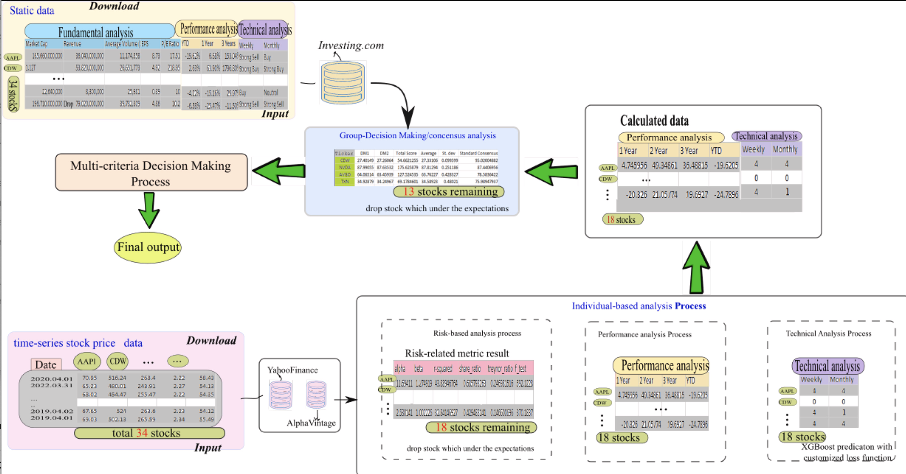
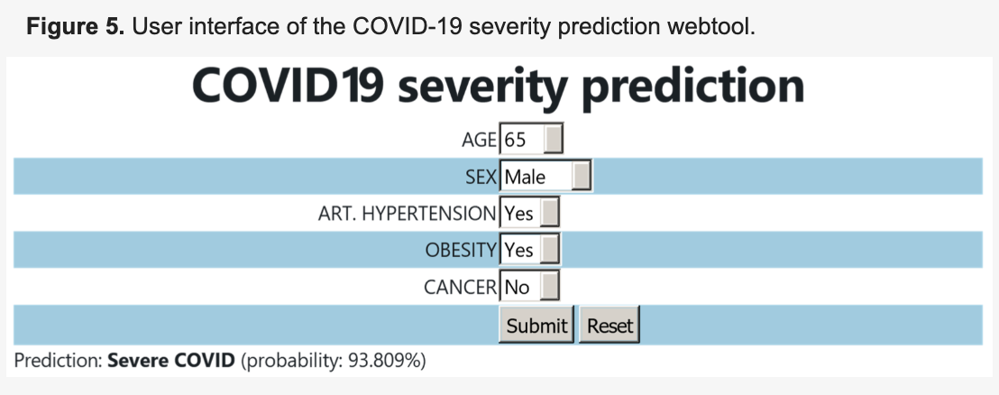
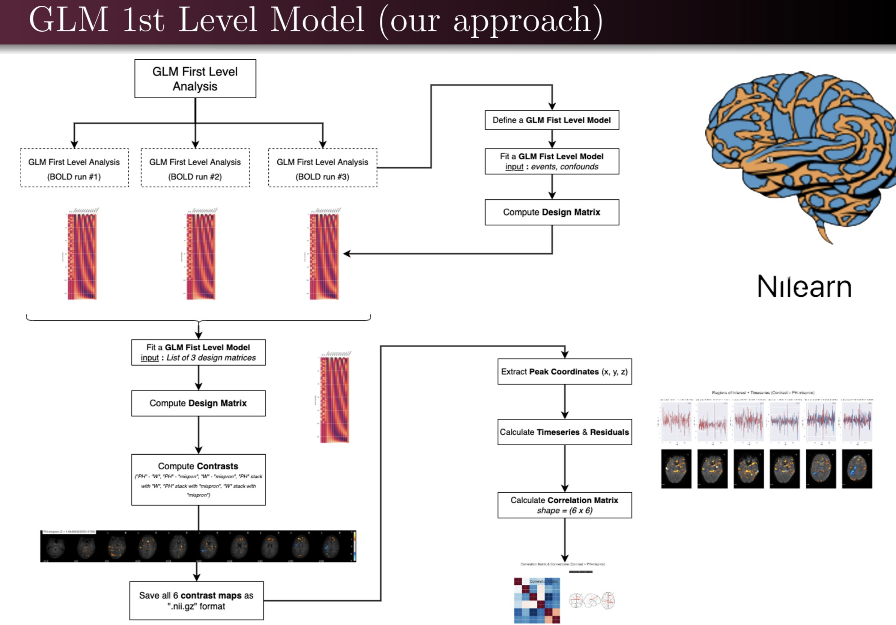

## Academic Publications {#academic-publications}

  

  <h3 id="multi-source-fusion-stock-selection">A Generalization of Multi-Source Fusion-Based Framework to Stock Selection</h3>
  
    
<strong>Authors:</strong> V Snášel, JD Velásquez, M Pant, D Georgiou, L Kong

    
<em>Information Fusion, 2024</em>

    
A novel framework for multi-source fusion-based stock selection, leveraging advanced machine learning techniques for financial decision-making.

  

    <a href="https://scholar.google.com/citations?view_op=view_citation&hl=en&user=whiGlXQAAAAJ&citation_for_view=whiGlXQAAAAJ:u-x6o8ySG0sC" class="btn btn--primary btn--small" target="_blank">Google Scholar</a>
    <a href="https://www.sciencedirect.com/science/article/pii/S1566253523003342" class="btn btn--primary btn--small" target="_blank">DOI</a>
      <a href="https://pdf.sciencedirectassets.com/272144/1-s2.0-S1566253523X00104/1-s2.0-S1566253523003342/main.pdf" class="btn btn--primary btn--small" target="_blank">PDF</a>
    

  

  

  <h3 id="covid-19-severity-prediction">A Machine Learning-Based Web Tool for the Severity Prediction of COVID-19</h3>
  
    
<strong>Authors:</strong> A Christodoulou, MS Katsarou, C Emmanouil, M Gavrielatos, D Georgiou, et al.

    
<em>BioTech, 2024</em>

    
Development of a web-based machine learning tool designed to predict the severity of COVID-19 using advanced predictive models.

  

    <a href="https://scholar.google.com/citations?view_op=view_citation&hl=en&user=whiGlXQAAAAJ&citation_for_view=whiGlXQAAAAJ:d1gkVwhDpl0C" class="btn btn--primary btn--small" target="_blank">Google Scholar</a>
    <a href="https://doi.org/10.3390/biotech13030022" class="btn btn--primary btn--small" target="_blank">DOI</a>
      <a href="https://www.mdpi.com/2673-6284/13/3/22" class="btn btn--primary btn--small" target="_blank">PDF</a>
      <a href="https://www.michalopoulos.net/covid/" class="btn btn--primary btn--small" target="_blank">Website</a>
    

  

  

  <h3 id="fmri-dyslexia-classification">fMRI-Based Classification and Visual Explanation of Dyslexia and Spelling Disorder using Machine & Deep Learning</h3>
    
    
<strong>Author:</strong> D Georgiou

    
<em>National Technical University of Athens, 2022</em>

    
A research study applying machine and deep learning techniques to classify and provide visual explanations for dyslexia and spelling disorders using fMRI data.

  

      <a href="http://artemis.cslab.ece.ntua.gr:8080/jspui/handle/123456789/18593" class="btn btn--primary btn--small" target="_blank">PDF</a>
    

  

## Academic Presentations {#academic-presentations}

  

    <h3 id="university-academy-2025">University Academy 2025 - Semi-supervised Machine Learning Project</h3>
    

      

        
        HSBC
      

      

        
        UEK
      

    

    
Complaints Classification: Sentiment Analytics, Machine Learning to assess if customer queries should have been logged as complaint

    

      

        
        
        
        <button class="gallery-nav prev" onclick="changeImageUekPub(-1)">‹</button>
        <button class="gallery-nav next" onclick="changeImageUekPub(1)">›</button>
        
        

          
          
        

      

    

    
<em>University of Economics in Krakow (UEK), January 2025</em>

    
I introduced students to using Machine Learning (ML) for Complaint Classification, demonstrating how ML enhances customer experience by detecting sentiment and repeat complaints, leading to smarter business decisions. I emphasized that ML isn't just about models but solving real problems. To build a strong career, I advised students to think critically, invest in practical skills like Python & cloud tools, and strengthen their network for better opportunities.

  

    <a href="https://www.linkedin.com/feed/update/urn:li:activity:7288560720093310976/" class="btn btn--primary btn--small" target="_blank">LinkedIn Post</a>
    

  

  

    <h3 id="hsbc-summer-school-2025">HSBC Summer School 2025 - Semi-supervised Machine Learning Project</h3>
    

      

        
        HSBC
      

    

    

      

        
        
        
        <button class="gallery-nav prev" onclick="changeImageHsbcSummer(-1)">‹</button>
        <button class="gallery-nav next" onclick="changeImageHsbcSummer(1)">›</button>
        
        

          
          
  

    

    
<em>HSBC Summer School 2025, Kraków</em>

    
Presented our semi-supervised ML project at HSBC Summer School. Shared work with bachelor's, master's, and PhD students plus HSBC professionals. Audience engagement was exceptional with thoughtful questions and follow-up discussions. Conversations ranged from AI/ML to LLMs and the future of technology. Key insight: Clear communication and genuine dialogue matter as much as technical expertise.

    

      <a href="https://www.linkedin.com/feed/update/urn:li:activity:7382460403420643329/" class="btn btn--primary btn--small" target="_blank">LinkedIn Post</a>
    

  

  

    <h3 id="klimaka-ai-webinar">KLIMAKA NGO - Understanding AI, Applications in Psychology, Psychotherapy & Psychiatry</h3>
    

      

        
        Klimaka NGO
      

    

    

      

        
        
        
        
        
        
        <button class="gallery-nav prev" onclick="changeImageKlimaka(-1)">‹</button>
        <button class="gallery-nav next" onclick="changeImageKlimaka(1)">›</button>
        
        

          
          
          
          
          
        

      

    

    
<em>Klimaka NGO, August 2025</em>

    
Delivered an internal webinar on Artificial Intelligence to over 60 participants at Klimaka NGO, exploring AI's evolution, impact on mental health, multimodal AI systems, and its applications in psychology, psychotherapy, and psychiatry. Discussed ongoing AI projects at Klimaka and actionable ideas for leveraging AI to address societal challenges in mental health and suicide prevention.

    

      <a href="https://www.linkedin.com/posts/dimitrios-georgiou_artificialintelligence-ai-mentalhealth-activity-7369739952537985024-1AJg?utm_source=share&utm_medium=member_desktop&rcm=ACoAAB9iLVIBxYpeomo-Y21fFLHo-YyxI_Rj_vk" class="btn btn--primary btn--small" target="_blank">LinkedIn Post</a>
    

  

