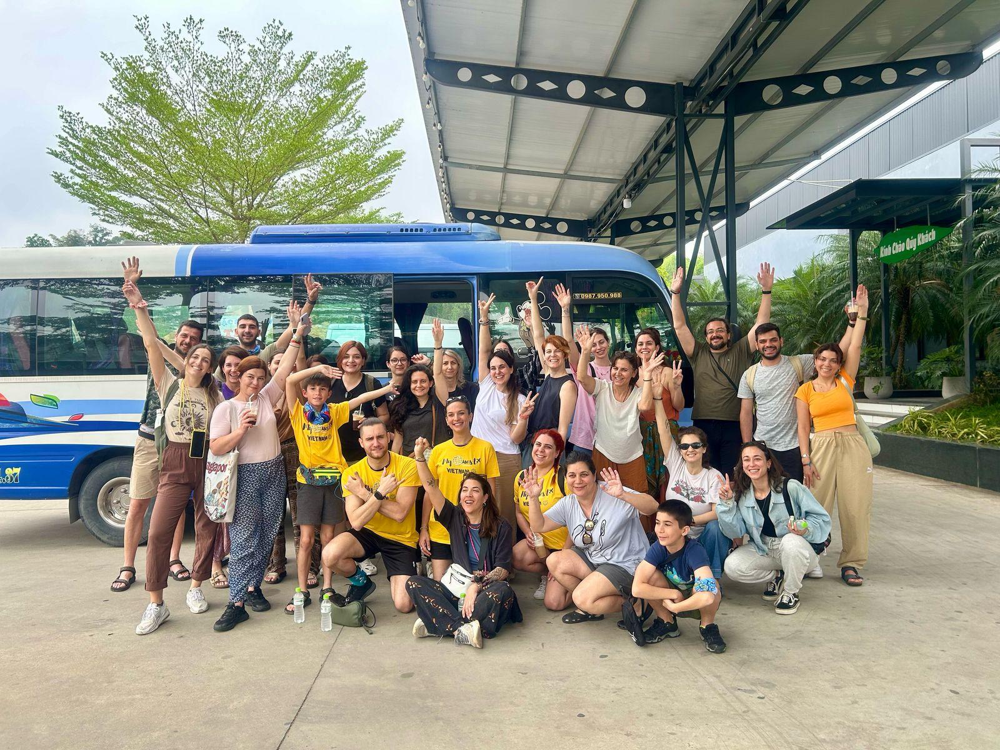
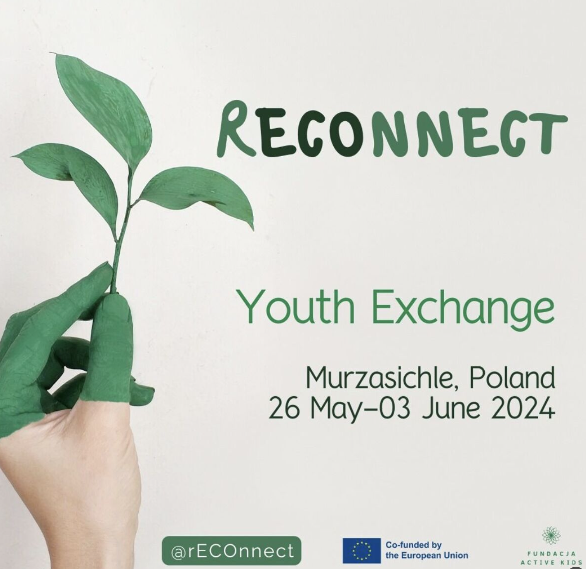
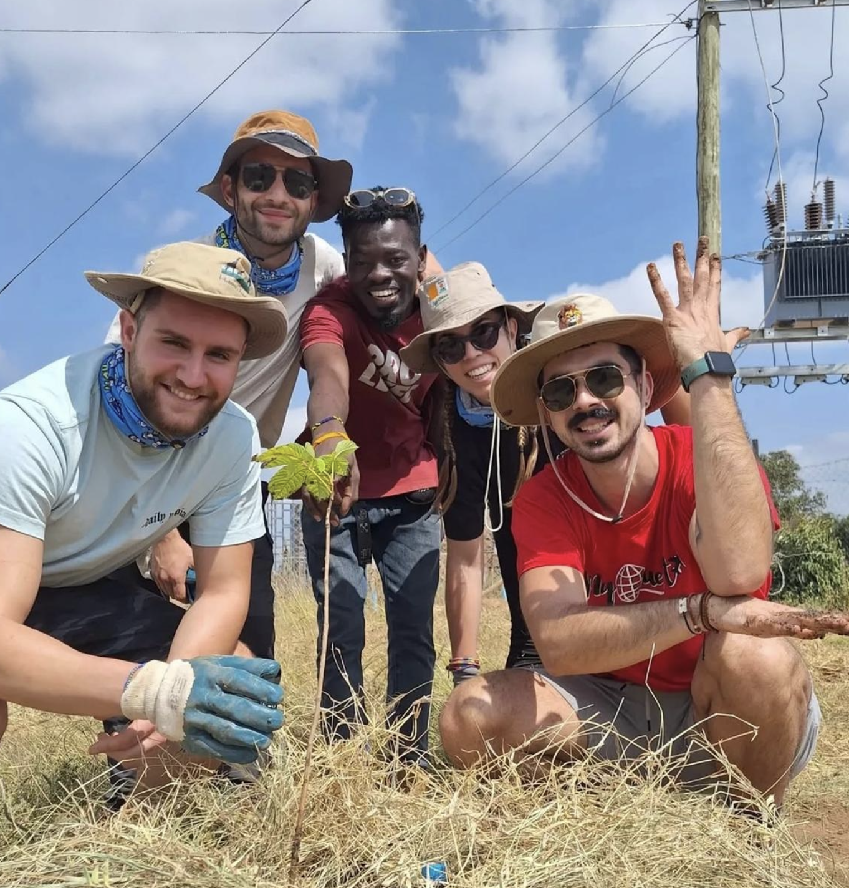
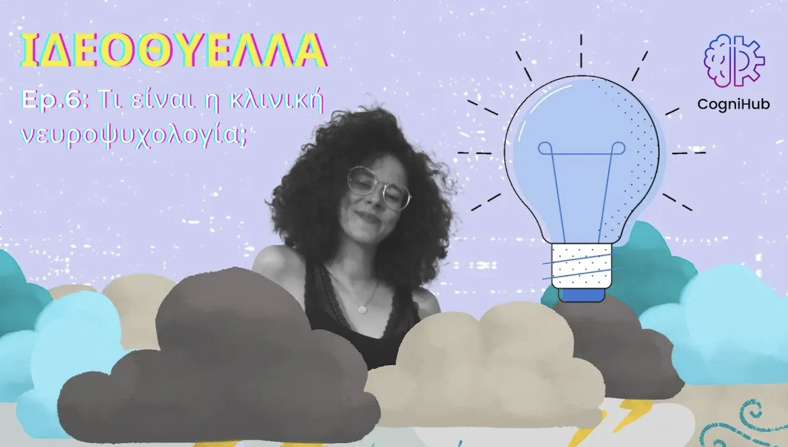
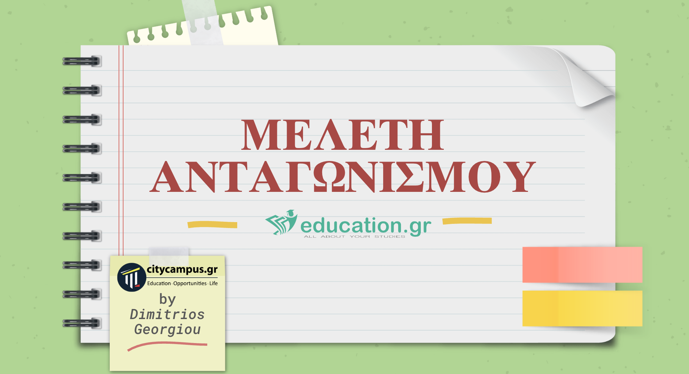
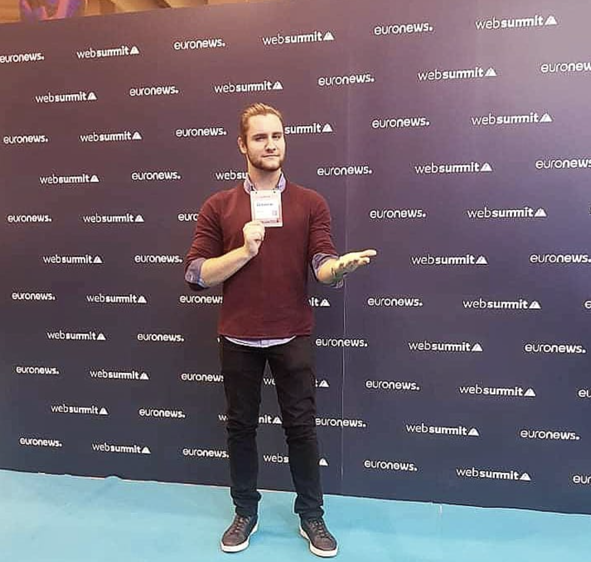
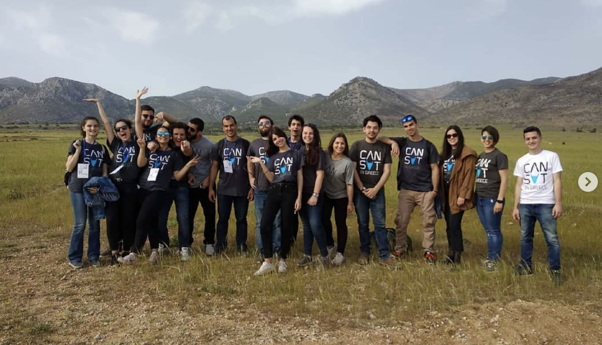
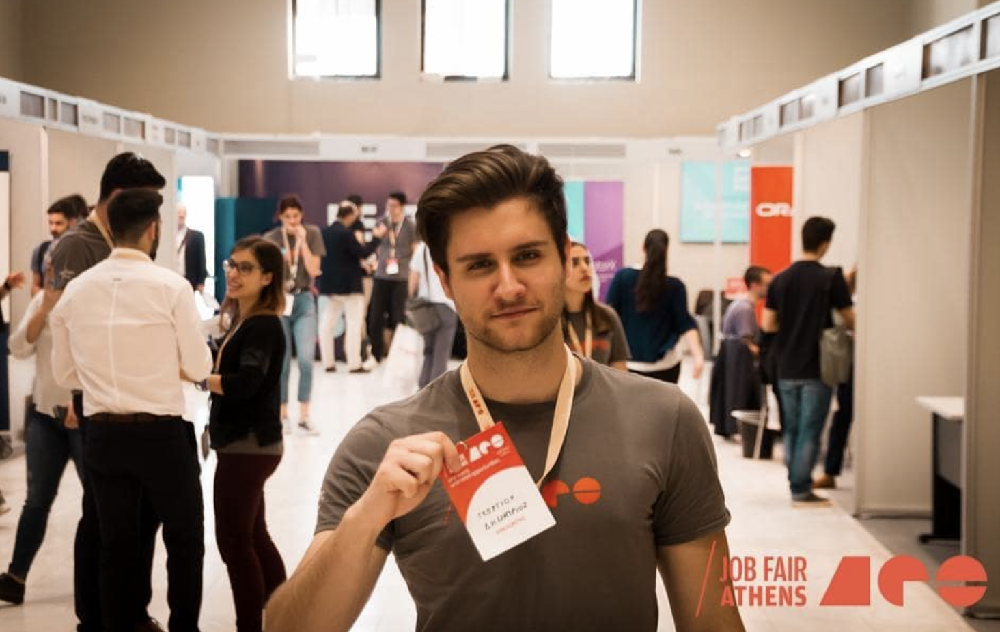
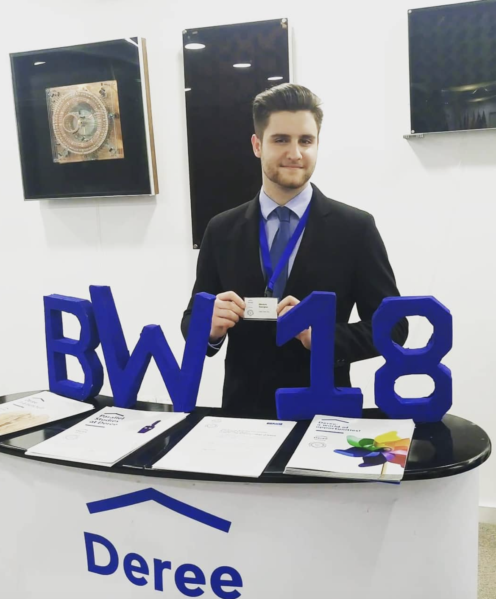

  
This section documents my volunteering journey, from local community initiatives to international youth exchanges. Each experience has contributed to my personal growth and reinforced my commitment to making a positive impact in the world.

## Volunteering Timeline {#volunteering-timeline}

  <!-- 2025 -->
  

    

      
May 2024

      <h3>Volunteer - Wheeling2help NGO</h3>
      
Volunteered with Wheeling2help in Da Bia, Vietnam, focusing on community development. Collaborating with the Muong ethnic community, I contributed to improving infrastructure at the local kindergarten and cultural centre, assisted in agricultural tasks, and participated in traditional art workshops. This immersive experience deepened my appreciation for cultural heritage preservation and reinforced my commitment to sustainable community empowerment.

      
    

  

  <!-- 2024 -->
  

    

      
May - June 2024

      <h3>Team Lead - Erasmus+ Youth Exchange</h3>
      
Led the Greek team 🇬🇷 at the Erasmus+ Youth Exchange, «rECOnnect», held in Tatra Mountains, Murzasichle, Zakopane, Poland📍. Focused on environmental initiatives and youth leadership development.

      
    

  

  

    

      
May 2024

      <h3>Volunteer - Wheeling2help NGO</h3>
      
Volunteered with Wheeling2help in Nepal, focusing on community empowerment through environmental conservation, sports development, and educational support initiatives.

      
    

  

  

    

      
January 2024

      <h3>Volunteer - Wheeling2help NGO</h3>
      
Volunteered with Wheeling2help in Kenya, working on environmental conservation, sports development, and education initiatives for sustainable community impact.

      
    

  

  <!-- 2021-2023 -->
  

    

      
January 2021 - October 2023

      <h3>Marketing Coordinator - CogniHub</h3>
      
Led marketing initiatives for CogniHub, an interdisciplinary non-profit student organization promoting interdisciplinarity through events, talks, and workshops.

      
    

  

  

    

      
January - November 2021

      <h3>Research And Development Specialist - citycampus.gr</h3>
      
Conducted competitive research and analyzed statistics using Python, Google Analytics, and SimilarWeb to improve educational platform performance.

      
    

  

  <!-- 2018 -->
  

    

      
November 2018

      <h3>Student Volunteer - Web Summit</h3>
      
Member of the Media Team at the world's largest tech conference in Lisbon, Portugal, assisting in interview booths and press conferences.

      
    

  

  <!-- 2017-2018 -->
  

    

      
September 2017 - April 2018

      <h3>Contact Person Volunteer - CanSat in Greece</h3>
      
Responsible for supporting one of ten participating school teams with programming and information-related challenges throughout the 8-month program.

      
    

  

  

    

      
November 2017 - April 2018

      <h3>Main Event Projects Volunteer - Job Fair Athens</h3>
      
Organized panels, speeches, and sessions on various topics including Technology and Life failures during the two-day event.

      
    

  

  <!-- 2017 -->
  

    

      
March 2018

      <h3>Interaction Volunteer - Business Week 2018</h3>
      
Represented the Career's office at The American College of Greece, promoting the internship program of Deree College.

      
    

  

  

    

      
May 2017

      <h3>Registration & Ticketing Volunteer - TEDxAthens</h3>
      
Managed registration and ticketing operations for the TEDxAthens event.

      
    

  

  <!-- 2016 -->
  

    

      
December 2016

      <h3>Arduino Workshops Organizer - IEEE NTUA Student Branch</h3>
      
Organized and conducted a 4-day Arduino workshop for students.

      
    

  

  <!-- 2011-2017 -->
  

    

      
March 2011 - May 2017

      <h3>Delegate - Model United Nations</h3>
      
Participated in various MUN conferences representing different countries and committees:

      <ul>
        <li>Costeas-Geitonas School MUN 2011 - Delegate of Bosnia Herzegovina</li>
        <li>Platon School MUN 2012 - Delegate of Guatemala</li>
        <li>Deutsche Schule Athens MUN 2012 - Delegate of U.S.A</li>
        <li>Costeas-Geitonas School MUN 2012 - Ambassador of Sierra Leone</li>
        <li>Platon School MUN 2013 - Ambassador of Azerbaijan</li>
        <li>Athens MUN 2013 - Ambassador of Chile</li>
        <li>Platon School MUN 2014 - Delegate of China</li>
        <li>Thessaloniki International Student MUN 2016 - Ambassador of Democratic Republic of Congo</li>
      </ul>
      
    

  

 